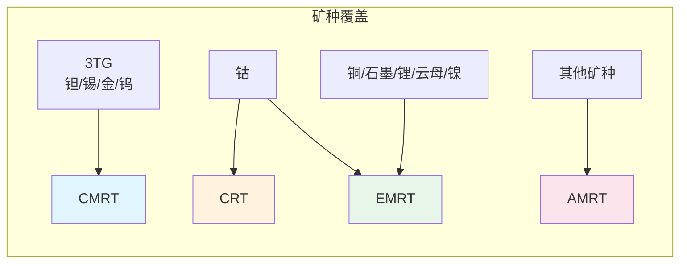
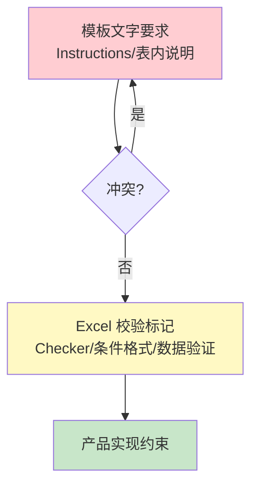
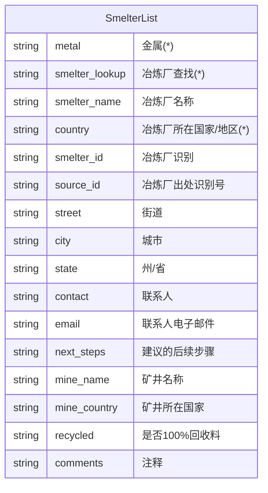
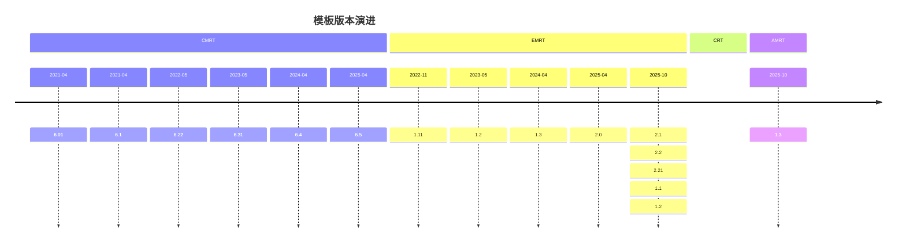

# 项目概述与通用规则

## 1. 项目背景

### 1.1 什么是冲突矿产模板

冲突矿产模板是由 RMI（Responsible Minerals Initiative，负责任矿产倡议）创建的免费标准化模板，用于企业披露供应链中矿产来源信息。本系统支持四种模板的编辑、查看与导出：

| 模板 | 全称 | 覆盖矿种 | 定位 |
|-----|------|---------|------|
| **CMRT** | Conflict Minerals Reporting Template | 3TG（钽/锡/金/钨） | 冲突矿产核心模板 |
| **EMRT** | Extended Minerals Reporting Template | 钴/铜/石墨/锂/云母/镍 | 扩展矿产模板 |
| **CRT** | Cobalt Reporting Template | 钴 | 钴专项模板 |
| **AMRT** | Additional Minerals Reporting Template | 排除上述矿种 | 其他矿产模板 |

### 1.2 模板定位关系

> 注：若企业为冶炼厂/精炼厂，模板建议在 Smelter List 填写本公司信息。

### 1.3 项目目标

- 统一多模板、多版本的编辑与查看规则
- 基于模板规则（Instructions + Checker + 表单结构）形成可执行的产品规则集
- 支持版本并存、规则可插拔、国际化可扩展

## 2. 术语定义

### 2.1 核心术语

| 术语 | 英文 | 定义 |
|-----|------|------|
| 3TG | 3TG | 钽(Tantalum)、锡(Tin)、金(Gold)、钨(Tungsten)四种冲突矿产 |
| CAHRA | Conflict-Affected and High-Risk Areas | 受冲突影响和高风险地区 |
| SEC | Securities and Exchange Commission | 美国证券交易委员会 |
| EU | European Union | 欧盟 |
| IPC1755 | IPC-1755 | 供应链尽职调查信息交换标准 |
| DRC | Democratic Republic of the Congo | 刚果民主共和国 |
| RMAP | Responsible Minerals Assurance Process | 负责任矿产保证流程 |

### 2.2 模板内术语

| 术语 | 说明 |
|-----|------|
| Declaration | 申报/声明页，包含公司信息和申报范围 |
| Smelter List | 冶炼厂清单 |
| Mine List | 矿厂清单（仅 EMRT 2.0+/AMRT） |
| Product List | 产品清单 |
| Minerals Scope | 矿物范围（仅 AMRT） |
| Checker | Excel 内置校验页，标记必填项与校验规则 |
| Smelter Look-up | 冶炼厂查找表，提供标准冶炼厂名录 |

### 2.3 字段标记说明

| 标记 | 含义 |
|-----|------|
| (*) | 必填字段 |
| F=1 | Checker 中标记为必填 |
| F=0 | Checker 中标记为非必填（可能存在条件必填） |

## 3. 通用规则

### 3.1 校验优先级

**规则说明**：
1. **Instructions 文字规则**最高优先级 - 若与 Checker 冲突，以文字为准
2. **Checker F=1** 直接视为必填
3. **条件格式/数据验证** 作为辅助提示
4. **产品约束** 不超越模板规则

### 3.2 申报范围联动规则

所有模板通用的联动规则：

| 申报范围选择 | 联动效果 |
|-------------|---------|
| A. Company | 公司级申报，无额外必填 |
| B. Product (or List of Products) | Product List 必填（至少填写产品编号） |
| C. User defined | 范围描述（Scope Description）必填 |

### 3.3 日期格式规范

- **统一格式**：`DD-MMM-YYYY`（如 `01-Jan-2026`）
- **输入兼容**：Excel 可将 `YYYY-MM-DD` 自动转换为标准格式
- **有效范围**：
  - EMRT/CRT/AMRT：`31-Dec-2006` 至 `31-Mar-2026`
  - CMRT 6.01-6.22：`31-Dec-2006` 至 `31-Mar-2026`
  - CMRT 6.31+：`> 31-Dec-2006`（无上限）
- **产品执行**：仅提示，不阻断提交

### 3.3.1 文件名示例（按模板 Instructions）

- **CMRT 6.x / AMRT 1.1-1.3**：`companyname-date.xls`（date as `YYYY-MM-DD`）
- **EMRT 1.x/2.x / CRT 2.x**：`companyname-date.xlsx`（date as `YYYY-MM-DD`）
- **产品执行**：仅提示，不阻断提交

### 3.4 语言输入建议

模板要求"仅以英文作答"，产品执行口径：

- **建议提示**：不阻断提交，不强制校验
- **字段值优先英文**：尤其是文本字段/备注/说明类输入
- **UI 可中文展示**：界面保留中文，提示用户"建议英文"

**推荐提示文案**：
- 通用：`模板建议英文填写，系统不强制，请尽量使用英文。`
- 问题区：`问题区建议英文作答（模板要求）。`
- 清单区：`清单字段建议英文填写（模板要求）。`

### 3.5 输入安全提示

模板多处提示：
- 单元格内容不应以 `=` 或 `#` 开头
- 产品层面可做弱校验/提示，不强制阻断

### 3.6 大小写容错

模板内下拉值大小写混用（如 `Smelter Not Listed` / `Smelter not listed`）：
- 文档统一小写口径
- 解析与校验需**大小写不敏感**

## 4. 通用数据结构

### 4.1 公司信息字段（跨模板通用）

| 字段 | 类型 | 必填 | 说明 |
|-----|------|------|------|
| 公司名称 | 文本 | 是 | Legal Name，不得使用缩写 |
| 申报范围或种类 | 下拉 | 是 | A/B/C 三选一 |
| 范围描述 | 文本 | 条件 | 申报范围=C 时必填 |
| 公司唯一识别信息 | 文本 | 否 | |
| 公司唯一授权识别信息 | 文本 | 否 | |
| 地址 | 文本 | 视模板 | AMRT 按 Instructions 必填 |
| 联系人姓名 | 文本 | 是 | |
| 联系人电子邮件 | 文本 | 是 | 无邮箱可填 `not available` |
| 联系人电话 | 文本 | 是 | |
| 授权人姓名 | 文本 | 是 | 不可填 `same` 等占位 |
| 授权人职务 | 文本 | 否 | |
| 授权人电子邮件 | 文本 | 是 | 无邮箱可填 `not available` |
| 授权人电话 | 文本 | 否 | |
| 生效日期/授权日期 | 日期 | 是 | DD-MMM-YYYY 格式 |

### 4.2 Smelter List 通用结构

### 4.3 Smelter List 特殊选项

| 选项 | 触发条件 | 后续操作 |
|-----|---------|---------|
| Smelter not listed | 冶炼厂不在目录中 | 必须手填冶炼厂名称 + 国家 |
| Smelter not yet identified | 冶炼厂尚未识别 | Standard Smelter Name=Unknown，国家按版本回填 |

## 5. 版本策略

### 5.1 版本定义

- 版本为"模板 + 规则"一体：每个版本独立 schema + 规则集
- 版本号格式：`主版本.次版本`（如 6.5、2.21）

### 5.2 全版本支持策略

- 同模板全版本支持：schema/规则/页面均以版本定义为准
- 跨版本不做自动推断；显示与导出遵循当前版本定义
- 版本差异需在 registry 显式声明，避免隐藏在组件/页面中

### 5.3 版本演进时间线

## 6. 非目标声明

本项目**不实现**以下内容：

- Excel 公式/宏引擎
- 后端 API 与数据持久层细节
- 跨版本自动数据迁移

## 7. 参考资料

- [CMRT PRD](./01-cmrt-prd.md) - CMRT 详细规则
- [EMRT PRD](./02-emrt-prd.md) - EMRT 详细规则
- [CRT PRD](./03-crt-prd.md) - CRT 详细规则
- [AMRT PRD](./04-amrt-prd.md) - AMRT 详细规则
- [跨模板对比](./05-cross-template.md) - 模板间差异对照
