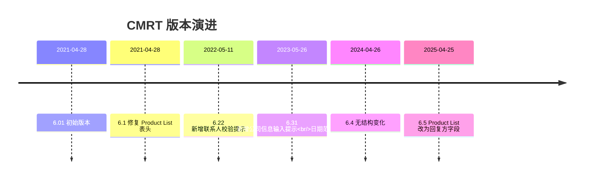
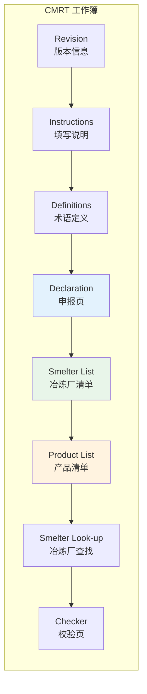
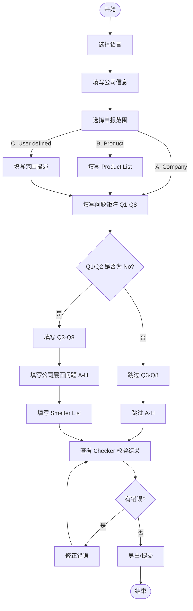
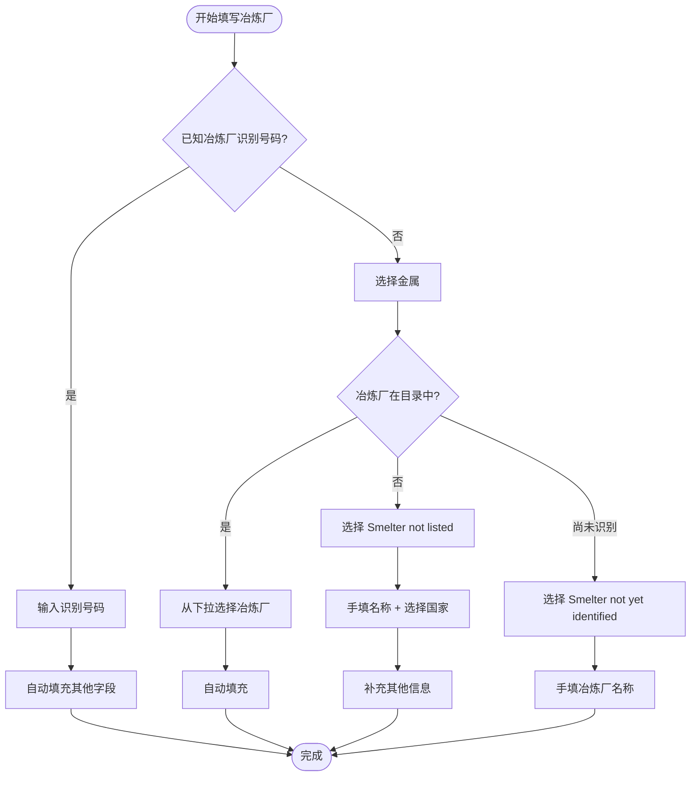
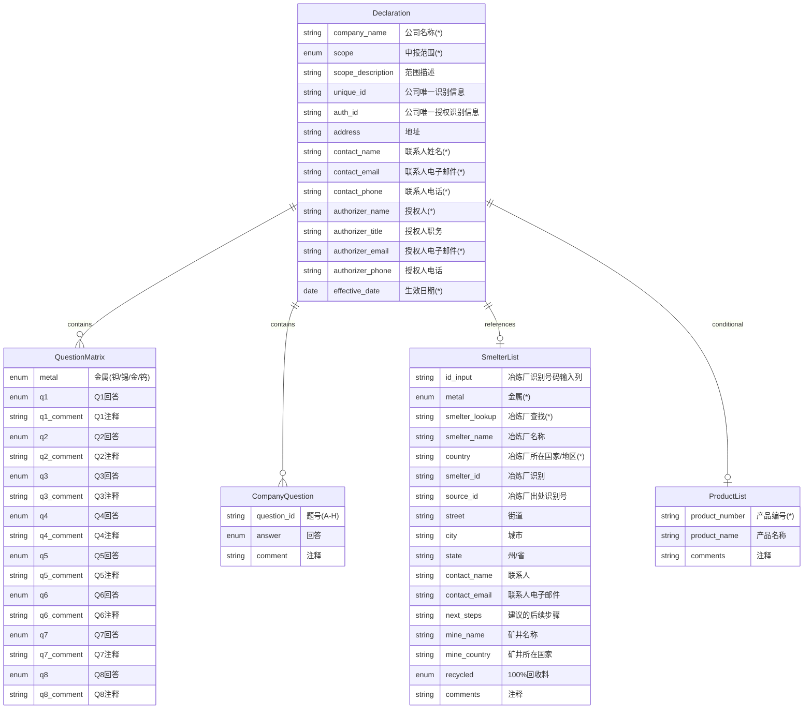
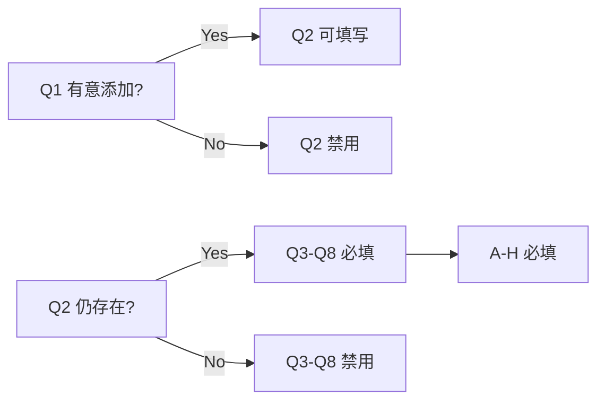

# CMRT 产品需求文档

> Conflict Minerals Reporting Template - 冲突矿产报告模板
> 版本范围：6.01 - 6.5

## 1. 模板概述

### 1.1 模板定位

CMRT（Conflict Minerals Reporting Template）是 RMI 创建的免费标准化模板，面向下游企业披露至冶炼厂之前的供应链信息。主要用于：

- **披露对象**：3TG（钽 Tantalum、锡 Tin、金 Gold、钨 Tungsten）
- **使用场景**：企业向客户/监管机构披露冲突矿产供应链信息
- **特殊说明**：若企业为 3TG 冶炼/精炼厂，建议在 Smelter List 填写本公司信息

### 1.2 版本演进



### 1.3 核心功能矩阵

| 功能模块         | 6.01 | 6.1 | 6.22 | 6.31 | 6.4 | 6.5 |
| ---------------- | ---- | --- | ---- | ---- | --- | --- |
| Declaration      | ✓    | ✓   | ✓    | ✓    | ✓   | ✓   |
| 问题矩阵 Q1-Q8   | ✓    | ✓   | ✓    | ✓    | ✓   | ✓   |
| 公司层面问题 A-H | ✓    | ✓   | ✓    | ✓    | ✓   | ✓   |
| Smelter List     | ✓    | ✓   | ✓    | ✓    | ✓   | ✓   |
| Smelter Look-up  | ✓    | ✓   | ✓    | ✓    | ✓   | ✓   |
| Product List     | ✓    | ✓   | ✓    | ✓    | ✓   | ✓   |

## 2. 信息架构

### 2.1 页面/Tab 结构



> 注：产品 UI 顺序以 **Checker 固定最后** 为准；Smelter Look-up 为数据支撑表，不参与 Tab 顺序。

### 2.2 页面功能说明

| 页面             | 用户可见 | 功能                                          |
| ---------------- | -------- | --------------------------------------------- |
| Revision         | 是       | 显示模板版本信息                              |
| Instructions     | 是       | 填写指南和规则说明                            |
| Definitions      | 是       | 术语定义                                      |
| **Declaration**  | 是       | 公司信息 + 申报范围 + 问题矩阵 + 公司层面问题 |
| **Smelter List** | 是       | 冶炼厂清单录入                                |
| **Product List** | 是       | 产品清单（申报范围=B时必填）                  |
| Checker          | 是       | 校验结果展示                                  |
| Smelter Look-up  | 否       | 数据支撑表（下拉来源）                        |

### 2.3 填写说明要点（Excel Instructions 对齐）

- **英文作答**：模板要求英文作答，产品仅提示不强制（见 `00-overview.md` 3.4）。
- **日期格式**：`DD-MMM-YYYY`，范围口径见 `00-overview.md` 3.3。
- **文件名示例**：`companyname-date.xls`（date as `YYYY-MM-DD`，见 `00-overview.md` 3.3.1）。

## 3. 用户流程

### 3.1 主流程图



### 3.2 Smelter List 填写流程



### 3.3 角色视角

| 角色          | 操作                                                       |
| ------------- | ---------------------------------------------------------- |
| 供应商/回复方 | 填写 Declaration、Smelter List、Product List；提交给采购方 |
| 采购方/审核方 | 查看提交内容；复核 Checker 结果；对齐模板版本差异          |

## 4. 数据模型

### 4.1 实体关系图



### 4.2 Declaration 公司信息字段

| 字段                   | 必填 | 类型 | 校验/选项                                                                                       | 说明                                                          |
| ---------------------- | ---- | ---- | ----------------------------------------------------------------------------------------------- | ------------------------------------------------------------- |
| 请选择你的语言         | 否   | 下拉 | English / 中文 / 日本語 / 한국어 / Français / Português / Deutsch / Español / Italiano / Türkçe |                                                               |
| 公司名称 (\*)          | 是   | 文本 | -                                                                                               | Legal Name，不得使用缩写                                      |
| 申报范围或种类 (\*)    | 是   | 下拉 | A. Company / B. Product / C. User defined                                                       |                                                               |
| 范围描述               | 条件 | 文本 | -                                                                                               | 申报范围=C 时必填                                             |
| 公司唯一识别信息       | 否   | 文本 | -                                                                                               |                                                               |
| 公司唯一授权识别信息   | 否   | 文本 | -                                                                                               |                                                               |
| 地址                   | 否   | 文本 | -                                                                                               |                                                               |
| 联系人姓名 (\*)        | 是   | 文本 | -                                                                                               |                                                               |
| 电子邮件 - 联系人 (\*) | 是   | 文本 | -                                                                                               | 无邮箱可填 `not available`                                    |
| 电话 - 联系人 (\*)     | 是   | 文本 | -                                                                                               |                                                               |
| 授权人 (\*)            | 是   | 文本 | -                                                                                               | 不可填 `same` 等占位                                          |
| 职务 - 授权人          | 否   | 文本 | -                                                                                               |                                                               |
| 电子邮件 - 授权人 (\*) | 是   | 文本 | -                                                                                               |                                                               |
| 电话 - 授权人          | 否   | 文本 | -                                                                                               |                                                               |
| 生效日期 (\*)          | 是   | 日期 | DD-MMM-YYYY                                                                                     | 6.01-6.22: 31-Dec-2006 ~ 31-Mar-2026<br/>6.31+: > 31-Dec-2006 |

### 4.3 根据上述申报范围，回答以下 1 至 8 题

每道题对 **钽/锡/金/钨** 四种金属分别回答。

| 问题   | 题干                                                                                     | 回答选项                                                                                                                                  | 依赖           |
| ------ | ---------------------------------------------------------------------------------------- | ----------------------------------------------------------------------------------------------------------------------------------------- | -------------- |
| **Q1** | 是否在产品或生产流程中有意添加或使用任何 3TG？                                           | Yes / No                                                                                                                                  | 无             |
| **Q2** | 是否有任何 3TG 仍存在于产品中？                                                          | Yes / No                                                                                                                                  | Q1≠No          |
| **Q3** | 贵公司供应链中的冶炼厂是否从所指明的国家采购 3TG？（有关术语“SEC”，请参见定义选项卡）     | Yes / No / Unknown                                                                                                                        | Q1≠No 且 Q2≠No |
| **Q4** | 贵公司供应链中是否有冶炼厂从受冲突影响和高风险地区采购 3TG？                              | Yes / No / Unknown                                                                                                                        | Q1≠No 且 Q2≠No |
| **Q5** | 是否 100% 的 3TG（因产品功能或生产而必须使用）来自于回收料或报废料？                      | Yes / No / Unknown                                                                                                                        | Q1≠No 且 Q2≠No |
| **Q6** | 已对贵公司供应链调查提供答复的相关供应商百分比是多少？                                   | 6.01-6.22: 1 / Greater than 90% / Greater than 75% / Greater than 50% / 50% or less / None<br/>6.31+: 100% / Greater than 90% / Greater than 75% / Greater than 50% / 50% or less / None | Q1≠No 且 Q2≠No |
| **Q7** | 您是否识别出为贵公司供应链供应 3TG 的所有冶炼厂？                                        | Yes / No                                                                                                                                  | Q1≠No 且 Q2≠No |
| **Q8** | 贵公司收到的所有适用冶炼厂信息是否已在此申报中报告？                                     | Yes / No                                                                                                                                  | Q1≠No 且 Q2≠No |

**交互规则补充**：

- Q1 ≠ Yes → Q2 置灰、禁用并清空
- Q2 ≠ Yes → Q3-Q8 置灰、禁用并清空

**联动规则图**：



### 4.4 从公司层面，回答以下问题

| 题号  | 题干                                                                                   | 回答选项                                                                                | 条件                            |
| ----- | -------------------------------------------------------------------------------------- | --------------------------------------------------------------------------------------- | ------------------------------- |
| **A** | 贵公司是否已制定负责任矿产采购政策？                                                   | Yes / No                                                                                |                                 |
| **B** | 贵公司的负责任矿产采购政策是否公开发布于贵公司网页上？（备注 - 如果是，请在注释字段中注明 URL。） | Yes / No                                                                                | Yes 时注释填 URL                |
| **C** | 您是否要求您的直接供应商从其尽职调查实践已被被独立第三方审核机构验证过的冶炼厂采购 3TG？       | Yes / No                                                                                |                                 |
| **D** | 贵公司是否已实施负责任矿产采购的尽职调查措施？                                         | Yes / No                                                                                |                                 |
| **E** | 贵公司是否开展了相关供应商的冲突矿产调查？                                             | Yes, in conformance with IPC1755 (e.g., CMRT) / Yes, using other format (describe) / No | "using other format" 时注释必填 |
| **F** | 贵公司是否根据公司期望来审查供应商提交的尽职调查信息？                                 | Yes / No                                                                                |                                 |
| **G** | 贵公司的验证程序是否包括纠正措施管理？                                                 | Yes / No                                                                                |                                 |
| **H** | 贵公司是否需要提交年度冲突矿产披露？                                                   | Yes, with the SEC / Yes, with the EU / Yes, with the SEC and the EU / No                |                                 |

**补充说明**：

- 当任一金属 Q1/Q2 ≠ No 的条件未满足时，A-H **不做必填校验，但仍允许填写（选填）**。

### 4.5 Smelter List 字段表

| 字段                                                                             | 必填 | 输入方式  | 说明                                                         |
| -------------------------------------------------------------------------------- | ---- | --------- | ------------------------------------------------------------ |
| 冶炼厂识别号码输入列                                                             | 否   | 手动      | 有值时触发自动填充                                           |
| 金属 (\*)                                                                        | 是   | 下拉      | 钽/锡/金/钨                                                  |
| 冶炼厂查找 (\*)                                                                  | 是   | 下拉      | 冶炼厂目录 + Smelter not listed + Smelter not yet identified |
| 冶炼厂名称                                                                       | 条件 | 手动      | Not listed 时必填                                            |
| 冶炼厂所在国家或地区 (\*)                                                        | 条件 | 下拉/手选 | Not listed 时必选                                            |
| 冶炼厂识别                                                                       | 否   | 自动      |                                                              |
| 冶炼厂出处识别号                                                                 | 否   | 自动      |                                                              |
| 冶炼厂所在街道                                                                   | 否   | 自动      |                                                              |
| 冶炼厂所在城市                                                                   | 否   | 自动      |                                                              |
| 冶炼厂地址：州/省                                                                | 否   | 自动      |                                                              |
| 冶炼厂联系人                                                                     | 否   | 手动      |                                                              |
| 冶炼厂联系人电子邮件                                                             | 否   | 手动      |                                                              |
| 建议的后续步骤                                                                   | 否   | 手动      |                                                              |
| 填写矿井名称，或如果所用矿产来自于回收料和报废料，请填写"回收"或"报废"。         | 否   | 手动      | 简称：矿井名称                                               |
| 填写矿井所在国家或地区，或如果所用矿产来自于回收料和报废料，请写"回收"或"报废"。 | 否   | 手动      | 简称：矿井国家                                               |
| 冶炼厂的被冶炼物料是否100%来自于回收料或报废料?                                  | 否   | 下拉      | Yes / No / Unknown                                           |
| 注释                                                                             | 否   | 手动      |                                                              |

**系统列（导出对齐用，默认只读）**：

- Standard Smelter Name
- Country Code
- State / Province Code
- Smelter not yet identified
- Smelter Not Listed
- Unknown

**金属下拉来源**：

- Smelter List 金属下拉固定为 4 金属（Tantalum/Tin/Gold/Tungsten），不随 Q1/Q2 变化。
- CMRT 无 Mine List。

### 4.6 Product List 字段表

| 字段          | 必填 | 说明                                                     |
| ------------- | ---- | -------------------------------------------------------- |
| 产品编号 (\*) | 是   | 6.4及以下为"制造商的产品序号"；6.5起为"回复方的产品编号" |
| 产品名称      | 否   | 6.4及以下为"制造商的产品名称"；6.5起为"回复方的产品名称" |
| 注释          | 否   | 6.01 第三列为空/0，6.1起修复为"注释"                     |

## 5. 校验规则

### 5.1 Checker 必填项（F=1）

| 分类         | 必填项                                                                                                |
| ------------ | ----------------------------------------------------------------------------------------------------- |
| 公司信息     | 公司名称、申报范围或种类、联系人姓名、电子邮件-联系人、电话-联系人、授权人、电子邮件-授权人、生效日期 |
| 问题矩阵     | Q1-Q8 × 钽/锡/金/钨（每题每金属）                                                                     |
| 公司层面问题 | A-H 全部                                                                                              |
| Smelter List | 每个金属（Tantalum/Tin/Gold/Tungsten）需提供冶炼厂清单                                                |

### 5.2 条件必填规则

```mermaid
flowchart TD
    subgraph 申报范围联动
        ScopeB[申报范围=B Product] --> ProductReq[Product List 必填]
        ScopeC[申报范围=C User defined] --> DescReq[范围描述必填]
    end

    subgraph 问题矩阵联动
        Q1Q2Yes[Q1/Q2≠No 任一金属] --> Q3Q8Req[该金属 Q3-Q8 必填]
        Q1Q2Yes --> AHReq[A-H 必填]
    end

    subgraph 公司层面联动
        BYes[B=Yes] --> URLReq[注释填 URL]
        EOther[E=Using other format] --> EComment[注释必填]
    end

    subgraph Smelter联动
        NotListed[冶炼厂查找=Smelter not listed] --> NameCountry[名称+国家必填(仅 6.01/6.1)]
    end
```

### 5.3 校验规则清单

| 规则ID | 触发条件                      | 校验内容                                  | 提示类型 |
| ------ | ----------------------------- | ----------------------------------------- | -------- |
| R001   | 申报范围=B                    | Product List 至少一行                     | 错误     |
| R002   | 申报范围=C                    | 范围描述不为空                            | 错误     |
| R003   | Q1≠No                         | Q2 必填；且 Q1≠No 且 Q2≠No 时，Q3-Q8 必填 | 错误     |
| R004   | 任一金属 Q1/Q2 ≠No            | A-H 必填                                  | 错误     |
| R005   | B=Yes                         | The URL in the comment field              | 错误     |
| R006   | E=Using other format          | 注释必填                                  | 错误     |
| R007   | 冶炼厂查找=Smelter not listed | 冶炼厂名称+国家必填（仅 6.01/6.1）        | 错误     |
| R008   | Q1≠No 且 Q2≠No                | Smelter List 需包含对应金属记录           | 错误     |
| R011   | 联系人/授权人邮箱             | 必须包含 `@`                              | 错误     |

> 备注：模板 Checker 只有 error/pass；历史“提示”类规则（如组合不合法、名称/国家含“!”）不在 Checker 中，原型不实现。

### 5.5 Checker 展示顺序

- 按 Excel Checker 的出现顺序展示：公司信息 → 问题矩阵（Q1→Q8）→ 公司层面问题（A→H）→ Smelter List →（Mine List / Product List 如存在）。
- 问题矩阵内部按 **Q1 → Q2 → Q3 → Q4 → Q5 → Q6 → Q7 → Q8**，金属顺序按表内固定顺序。

### 5.6 Checker 显示

- 错误项仅显示所属模块标题（公司信息 / 根据上述申报范围，回答以下 1 至 8 题 / 从公司层面，回答以下问题 / 冶炼厂清单 等），不展示规则ID或问号提示。

### 5.4 DV 错误提示文案

| 场景           | 版本   | errorTitle     | error                                                       |
| -------------- | ------ | -------------- | ----------------------------------------------------------- |
| 申报范围未选择 | 全版本 | Required Field | Select from dropdown options to declare survey scope        |
| 联系人姓名为空 | 6.22+  | Blank Field    | Please enter your contact name.                             |
| 日期格式错误   | 全版本 | Invalid Date   | Date entered must be in international format DD-MMM-YYYY... |

## 6. 版本差异

### 6.1 版本差异对照表

| 变更项                           | 6.01             | 6.1              | 6.22             | 6.31      | 6.4       | 6.5       |
| -------------------------------- | ---------------- | ---------------- | ---------------- | --------- | --------- | --------- |
| Product List 第三列表头          | 0/空             | 注释             | 注释             | 注释      | 注释      | 注释      |
| 联系人姓名 DV 提示               | 无               | 无               | 有               | 有        | 有        | 有        |
| 公司信息 prompt 文案             | 无               | 无               | 无               | 有        | 有        | 有        |
| 生效日期 DV 上限                 | 31-Mar-2026      | 31-Mar-2026      | 31-Mar-2026      | 无上限    | 无上限    | 无上限    |
| Product List 字段语义            | 制造商           | 制造商           | 制造商           | 制造商    | 制造商    | 回复方    |
| Smelter List 金属下拉来源        | 固定4金属        | 固定4金属        | 固定4金属        | 固定4金属 | 固定4金属 | 固定4金属 |
| Smelter not listed 名称/国家强制 | ✓                | ✓                | -                | -         | -         | -         |
| Q6 “100%” 取值                   | 1（显示为 100%） | 1（显示为 100%） | 1（显示为 100%） | 100% 文本 | 100% 文本 | 100% 文本 |

### 6.2 关键变更说明

#### 6.01 → 6.1

- **Product List 表头修复**：第三列表头由"0/空值"修复为"注释"

#### 6.22 → 6.31

- **生效日期 DV 范围调整**：从 `31-Dec-2006 ~ 31-Mar-2026` 改为 `> 31-Dec-2006`（无上限）
- **新增公司信息 prompt 文案**：Company Name、Contact Name 等字段增加输入提示

#### 6.4 → 6.5

- **Product List 字段语义变化**：
  - "制造商的产品序号/名称" → "回复方的产品编号/名称"
- **Definitions/Instructions 更新**：RMAP "audit protocol" 措辞更新为 "assessment standard"

### 6.3 Smelter not yet identified 行为差异

| 版本           | Standard Smelter Name | Country |
| -------------- | --------------------- | ------- |
| 6.01-6.4       | Unknown               | Unknown |
| 6.5 (Tungsten) | Unknown               | 空      |
| 6.5 (其他金属) | Unknown               | Unknown |

## 7. 导出规范

### 7.1 Excel 列映射

导出时需保持与原模板结构一致：

| 页面         | 列顺序         | 说明                              |
| ------------ | -------------- | --------------------------------- |
| Declaration  | 按模板原有布局 | 包含系统隐藏列                    |
| Smelter List | A-T+           | 含系统列 Standard Smelter Name 等 |
| Product List | A-C            | 产品编号/名称/注释                |

### 7.2 系统/隐藏列说明

以下列为系统自动填充或辅助字段，导出时需包含但 UI 可隐藏：

| 列名                       | 说明                       |
| -------------------------- | -------------------------- |
| Standard Smelter Name      | 标准冶炼厂名称（自动填充） |
| Country Code               | 国家代码                   |
| State / Province Code      | 州/省代码                  |
| Smelter not yet identified | 系统标记                   |
| Smelter Not Listed         | 系统标记                   |
| Unknown                    | 系统标记                   |

## 8. 实现注意事项

1. **校验优先级**：Instructions 文字 > Checker 标记 > 条件格式
2. **大小写容错**：`Smelter Not Listed` 与 `Smelter not listed` 需等价处理
3. **日期格式**：接受 `YYYY-MM-DD` 输入，显示/导出为 `DD-MMM-YYYY`
4. **联系人信息合规**：填写冶炼厂联系人前需提示用户确认已获得同意
5. **输入安全**：提示用户避免以 `=` 或 `#` 开头
6. **版本判断**：根据版本号决定 DV 范围、字段语义等差异处理

## 9. UX 交互规范

本章节定义产品层面的用户体验增强规范，在保持与官方 Excel 模板一致性的基础上，优化用户填写效率和体验。

### 9.1 必填项标识

| 元素     | 规范                                                   |
| -------- | ------------------------------------------------------ |
| 视觉样式 | 必填字段使用黄色底色（#FFFF00），与官方 Excel 保持一致 |
| 文字说明 | 页面顶部或表单区域显示提示："黄色底色字段为必填"       |
| 位置     | 提示文字置于 Declaration 页面公司信息区域上方          |

### 9.2 填写进度指示与页面切换

- 顶栏不再展示 tabs 导航，仅保留品牌/语言/版本/导出
- 在顶栏下方显示步骤进度指示器，进度条可点击切换页面
- 每页底部提供“上一页/下一页”按钮（Review 页仅“上一页”+“提交”）

```
Step 1/4 - Declaration → Smelter → Product → Checker
           ^^^^^^^^^^^
           (当前高亮)
```

| 状态       | 样式                   |
| ---------- | ---------------------- |
| 当前步骤   | 高亮显示（主色调背景） |
| 已完成步骤 | 显示勾选图标 ✓         |
| 未到达步骤 | 灰色显示               |

### 9.3 禁用状态视觉反馈

当字段因依赖条件不满足而禁用时（如 Q3-Q8 在 Q1/Q2=No 时），需提供明确的视觉反馈：

| 元素     | 规范                                               |
| -------- | -------------------------------------------------- |
| 遮罩层   | 半透明遮罩（opacity: 0.6）覆盖禁用区域             |
| 说明文字 | 显示原因说明，如"因 Q1/Q2 选择 No，此部分无需填写" |
| 交互     | 禁用区域不可点击，鼠标显示 not-allowed             |

### 9.4 Smelter List 表格优化

| 功能     | 规范                                                 |
| -------- | ---------------------------------------------------- |
| 列固定   | "金属"和"冶炼厂名称"列固定在左侧，横向滚动时保持可见 |
| 实现方式 | CSS `position: sticky; left: 0;`                     |
| 背景色   | 固定列使用浅色背景以区分                             |

### 9.5 全局错误提示

在页面顶部（顶栏下方）固定显示校验状态摘要：

| 状态     | 样式     | 文案示例                 |
| -------- | -------- | ------------------------ |
| 有错误   | 红色背景 | ⚠️ 还有 5 个必填项未完成 |
| 全部通过 | 绿色背景 | ✅ 所有必填项已完成      |

- 点击错误提示可跳转到 Checker 页面
- 错误数量实时更新
- Checker 页面不展示统计卡片（通过/错误/完成度），避免与进度条信息重复

### 9.6 定位高亮动画

从 Checker 页面点击"定位"按钮跳转后，目标字段显示高亮动画：

| 属性     | 规范                                  |
| -------- | ------------------------------------- |
| 动画类型 | pulse（呼吸闪烁）或 shake（轻微抖动） |
| 持续时间 | 1.5 秒                                |
| 颜色     | 使用主色调（--primary）的半透明版本   |
| 结束后   | 恢复正常样式，保持焦点在目标字段      |

```css
@keyframes highlight-pulse {
  0%,
  100% {
    box-shadow: 0 0 0 0 rgba(21, 101, 192, 0.4);
  }
  50% {
    box-shadow: 0 0 0 8px rgba(21, 101, 192, 0);
  }
}
```

### 9.7 离开确认提示

当页面有未保存的修改数据时，用户尝试离开页面（关闭/刷新/导航）需显示确认：

| 属性     | 规范                               |
| -------- | ---------------------------------- |
| 触发条件 | 任意表单字段有输入内容             |
| 提示方式 | 浏览器原生 `beforeunload` 对话框   |
| 提示文案 | "您有未保存的数据，确定要离开吗？" |

### 9.8 Checker 错误分组展示

错误项按模块分组展示，便于用户快速定位问题区域：

| 分组               | 包含规则                         |
| ------------------ | -------------------------------- |
| 公司信息           | 公司名称、联系人、授权人等必填项 |
| 问题矩阵 (Q1-Q8)   | R003 相关错误                    |
| 公司层面问题 (A-H) | R004、R005、R006 相关错误        |
| 冶炼厂清单         | R007、R008 相关错误              |
| 产品清单           | R001 相关错误                    |

每组显示：

- 分组标题 + 错误数量徽章
- 折叠/展开控制
- 单项错误支持"定位"跳转

### 9.9 提交前 Checker Modal

Review 页提供“提交”按钮，点击后弹出 Checker Modal，展示：

| 内容     | 说明                            |
| -------- | ------------------------------- |
| 完成度   | 当前总体完成度百分比            |
| 错误数量 | 未完成/不符合的错误条数         |
| 错误摘要 | 前 5 条错误列表（含模块与提示） |

- 若错误数量为 0，Modal 显示“全部通过”，并禁用“去修复”按钮
- “去修复”→ 跳转至 Review 页错误列表并定位
- “继续填写”→ 关闭 Modal，返回当前填写页面

### 9.10 通过项折叠

Checker 中的"通过"项默认折叠，仅显示摘要：

| 状态   | 显示                   |
| ------ | ---------------------- |
| 默认   | ✅ 已通过 25 项 [展开] |
| 展开后 | 显示完整通过项列表     |

### 9.11 视觉与交互细节

#### Loading 状态

- 导出数据时显示 loading 动画和"正在导出..."提示
- 自动填充时显示短暂的加载指示

#### 键盘导航

- Tab 键：在表单字段间顺序导航
- Enter 键：确认选择 / 跳转下一字段
- Escape 键：取消当前编辑 / 关闭弹窗

#### 响应式适配

- 断点：1024px 以下切换为单列布局
- 表格在移动端支持横向滚动
- 触摸设备优化点击区域（最小 44px）

## 10. 参考文档

- [项目概述](./00-overview.md) - 通用规则与术语
- [跨模板对比](./05-cross-template.md) - 与其他模板的差异
