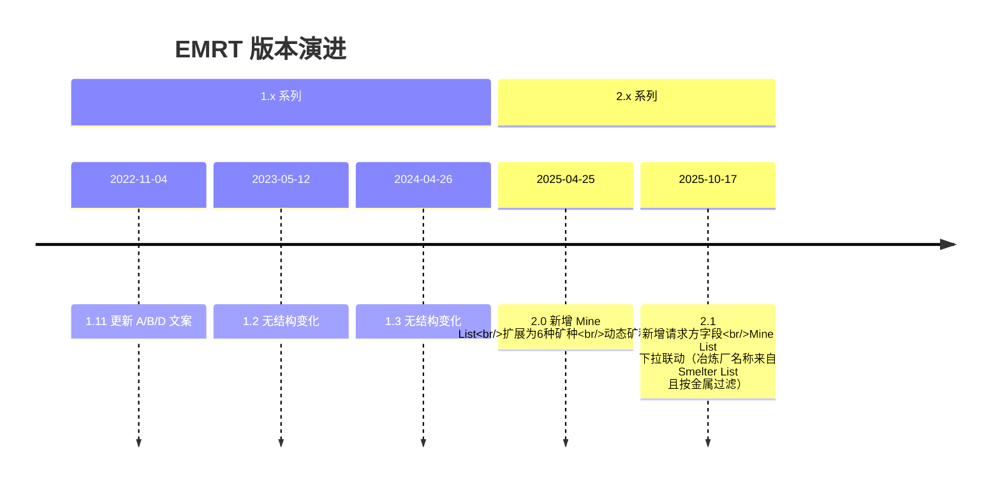
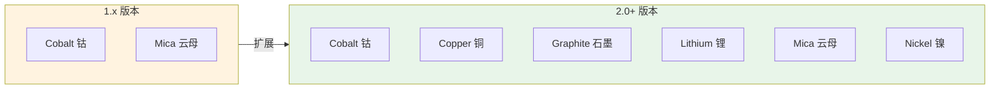
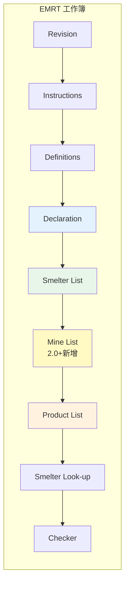
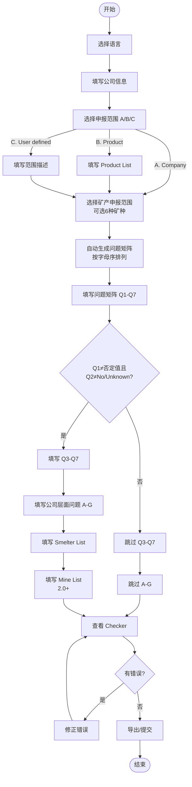
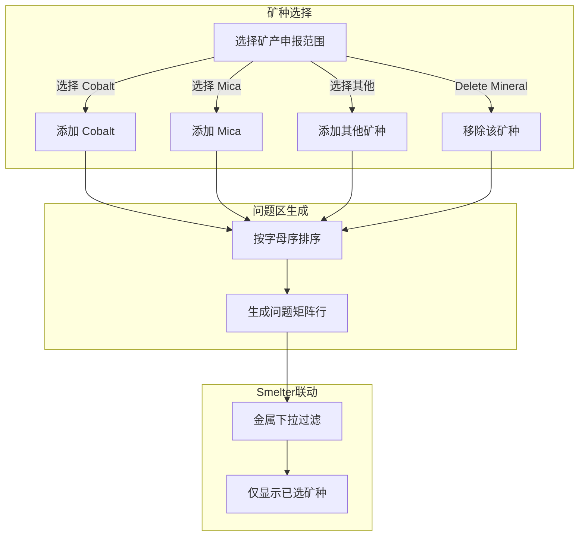
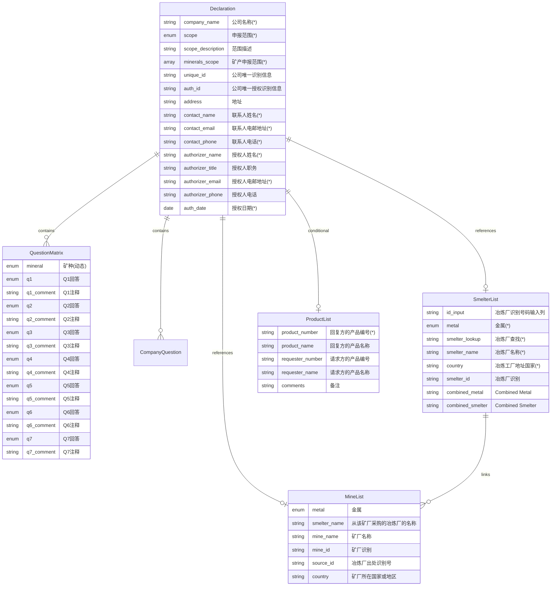
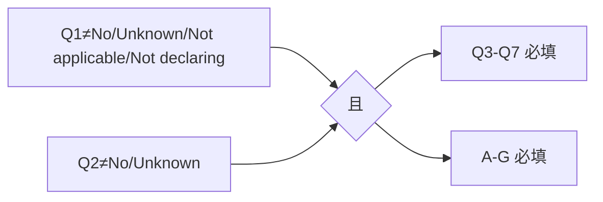

# EMRT 产品需求文档

> Extended Minerals Reporting Template - 扩展矿产报告模板
> 版本范围：1.1 - 2.1

## 1. 模板概述

### 1.1 模板定位

EMRT（Extended Minerals Reporting Template）是 RMI 创建的免费标准化模板，用于披露 CMRT 覆盖范围之外的扩展矿产供应链信息。主要用于：

- **披露对象**：钴(Cobalt)、铜(Copper)、石墨(Graphite)、锂(Lithium)、云母(Mica)、镍(Nickel)
- **使用场景**：企业向客户/监管机构披露扩展矿产供应链信息
- **特殊说明**：若企业为冶炼/精炼厂，建议在 Smelter List 填写本公司信息
- **演进背景**：EMRT 1.0 由 Cobalt Reporting Template 更名并将 Mica 纳入范围

### 1.2 版本演进

### 1.3 核心功能矩阵

| 功能模块 | 1.1 | 1.11 | 1.2 | 1.3 | 2.0 | 2.1 |
|---------|-----|------|-----|-----|-----|-----|
| Declaration | ✓ | ✓ | ✓ | ✓ | ✓ | ✓ |
| 矿产申报范围 | 固定2种 | 固定2种 | 固定2种 | 固定2种 | 动态6种 | 动态6种 |
| 问题矩阵 Q1-Q7 | ✓ | ✓ | ✓ | ✓ | ✓ | ✓ |
| 公司层面问题 A-G | ✓ | ✓ | ✓ | ✓ | ✓ | ✓ |
| Smelter List | ✓ | ✓ | ✓ | ✓ | ✓ | ✓ |
| **Mine List** | - | - | - | - | ✓ | ✓ |
| Product List | ✓ | ✓ | ✓ | ✓ | ✓ | ✓ |
| 请求方字段 | - | - | - | - | - | ✓ |

### 1.4 矿种范围演进

## 2. 信息架构

### 2.1 页面/Tab 结构

> 注：**1.x 与 2.0** 的实际模板顺序为 **Instructions 在 Revision 之前**；**2.1** 起调整为 **Revision 在 Instructions 之前**。下方流程图以 2.1 为主。产品 UI 顺序以 **Checker 固定最后** 为准；Smelter Look-up 为数据支撑表，不参与 Tab 顺序。

### 2.2 页面功能说明

| 页面 | 版本 | 功能 |
|-----|------|------|
| Revision | 全版本 | 版本信息 |
| Instructions | 全版本 | 填写指南 |
| Definitions | 全版本 | 术语定义 |
| **Declaration** | 全版本 | 公司信息 + 矿产申报范围 + 问题矩阵 + 公司层面问题 |
| **Smelter List** | 全版本 | 冶炼厂清单 |
| **Mine List** | 2.0+ | 矿厂清单 |
| **Product List** | 全版本 | 产品清单 |
| Checker | 全版本 | 校验结果 |
| Smelter Look-up | 全版本 | 数据支撑表 |

### 2.3 填写说明要点（Excel Instructions 对齐）

- **英文作答**：模板要求英文作答，产品仅提示不强制（见 `00-overview.md` 3.4）。
- **日期格式**：`DD-MMM-YYYY`，范围口径见 `00-overview.md` 3.3。
- **文件名示例**：`companyname-date.xlsx`（date as `YYYY-MM-DD`，见 `00-overview.md` 3.3.1）。
- **术语口径**：CAHRA 等定义见 `00-overview.md` 2.1。

## 3. 用户流程

### 3.1 主流程图（2.0+ 版本）

### 3.2 矿种选择联动流程

### 3.3 1.x vs 2.0+ 流程差异

| 流程节点 | 1.x | 2.0+ |
|---------|-----|------|
| 矿产申报范围 | 固定 Cobalt/Mica | 6种矿种多选 |
| 问题矩阵 | 固定2行 | 动态生成，按字母序 |
| Q3 选项 | Cobalt: DRC only Mica: India/Madagascar only | 统一 Yes/No/Unknown |
| Q5 选项 | 无 Did not survey | 新增 Did not survey |
| Mine List | 不存在 | 新增页面 |
| 公司层面 C/E | 指"钴/云母" | 改为"指定矿产" |

## 4. 数据模型

### 4.1 实体关系图

### 4.2 Declaration 公司信息字段

| 字段 | 必填 | 类型 | 说明 |
|-----|------|------|------|
| 请选择你的语言 | 否 | 下拉 | English / 中文 / 日本語 / 한국어 / Français / Deutsch |
| 公司名称（*） | 是 | 文本 | Legal Name，不得使用缩写 |
| 申报范围或种类 (*) | 是 | 下拉 | A. Company / B. Product / C. User defined |
| 范围描述 | 条件 | 文本 | 申报范围=C 时必填 |
| 选择贵公司的矿产申报范围 (*) | 是 | 多选下拉 | 2.0+: Cobalt/Copper/Graphite/Lithium/Mica/Nickel 含 Delete [Mineral] |
| 公司唯一识别信息 | 否 | 文本 | |
| 公司唯一授权识别信息 | 否 | 文本 | |
| 地址 | 否 | 文本 | |
| 联系人姓名 (*) | 是 | 文本 | |
| 联系人电邮地址 (*) | 是 | 文本 | 无邮箱可填 `not available` |
| 联系人电话 (*) | 是 | 文本 | |
| 授权人姓名 (*) | 是 | 文本 | 不可填 `same` 等占位 |
| 授权人职务 | 否 | 文本 | |
| 授权人电邮地址 (*) | 是 | 文本 | |
| 授权人电话 | 否 | 文本 | |
| 授权日期 (*) | 是 | 日期 | DD-MMM-YYYY，范围 31-Dec-2006 ~ 31-Mar-2026 |

### 4.3 根据上述指明的申报范围回答下列问题 1 - 7

每道题对 **已选矿种** 分别回答，按字母序排列。

#### 4.3.1 EMRT 1.1 问题矩阵

| 问题 | 题干 | 回答选项 | 依赖 |
|-----|------|---------|------|
| **Q1** | 是否在产品或生产流程中有意添加或使用任何钴或天然云母？ | Yes / No / Unknown / Not applicable for this declaration | 无 |
| **Q2** | 产品中是否还存有任何钴或天然云母？ | Yes / No / Unknown | Q1≠No/Unknown/Not applicable(1.x) |
| **Q3** | 贵公司供应链中是否有冶炼厂或加工厂从受冲突影响和高风险地区采购钴或天然云母？（《经合组织尽职调查指南》，参见定义选项卡） | **Cobalt: Yes / No / Unknown / DRC only** **Mica: Yes / No / Unknown / India and/or Madagascar only** | Q1≠No/Unknown/Not applicable(1.x) 且 Q2≠No/Unknown |
| **Q4** | 是否 100% 的钴来自回收料或报废料资源？ | Yes / No / Unknown | Q1≠No/Unknown/Not applicable(1.x) 且 Q2≠No/Unknown |
| **Q5** | 百分之多少的相关供应商已对贵公司的供应链调查提供答复？ | 1 / Greater than 90% / Greater than 75% / Greater than 50% / 50% or less / None | Q1≠No/Unknown/Not applicable(1.x) 且 Q2≠No/Unknown |
| **Q6** | 您是否识别出为贵公司的供应链供应钴或天然云母的所有冶炼厂或加工厂？ | Yes / No / Unknown | Q1≠No/Unknown/Not applicable(1.x) 且 Q2≠No/Unknown |
| **Q7** | 贵公司收到的所有适用冶炼厂或加工厂信息是否已在此申报中报告？ | Yes / No / Unknown | Q1≠No/Unknown/Not applicable(1.x) 且 Q2≠No/Unknown |

#### 4.3.2 EMRT 1.11 问题矩阵

| 问题 | 题干 | 回答选项 | 依赖 |
|-----|------|---------|------|
| **Q1** | 是否在产品或生产流程中有意添加或使用任何钴或天然云母？ | Yes / No / Unknown / Not applicable for this declaration | 无 |
| **Q2** | 产品中是否还存有任何钴或天然云母？ | Yes / No / Unknown | Q1≠No/Unknown/Not applicable(1.x) |
| **Q3** | 贵公司供应链中是否有冶炼厂或加工厂从受冲突影响和高风险地区采购钴或天然云母？（《经合组织尽职调查指南》，参见定义选项卡） | **Cobalt: Yes / No / Unknown / DRC only** **Mica: Yes / No / Unknown / India and/or Madagascar only** | Q1≠No/Unknown/Not applicable(1.x) 且 Q2≠No/Unknown |
| **Q4** | 是否 100% 的钴来自回收料或报废料资源？ | Yes / No / Unknown | Q1≠No/Unknown/Not applicable(1.x) 且 Q2≠No/Unknown |
| **Q5** | 百分之多少的相关供应商已对贵公司的供应链调查提供答复？ | 1 / Greater than 90% / Greater than 75% / Greater than 50% / 50% or less / None | Q1≠No/Unknown/Not applicable(1.x) 且 Q2≠No/Unknown |
| **Q6** | 您是否识别出为贵公司的供应链供应钴或天然云母的所有冶炼厂或加工厂？ | Yes / No / Unknown | Q1≠No/Unknown/Not applicable(1.x) 且 Q2≠No/Unknown |
| **Q7** | 贵公司收到的所有适用冶炼厂或加工厂信息是否已在此申报中报告？ | Yes / No / Unknown | Q1≠No/Unknown/Not applicable(1.x) 且 Q2≠No/Unknown |

#### 4.3.3 EMRT 1.2 问题矩阵

| 问题 | 题干 | 回答选项 | 依赖 |
|-----|------|---------|------|
| **Q1** | 是否在产品或生产流程中有意添加或使用任何钴或天然云母？ | Yes / No / Unknown / Not applicable for this declaration | 无 |
| **Q2** | 产品中是否还存有任何钴或天然云母？ | Yes / No / Unknown | Q1≠No/Unknown/Not applicable(1.x) |
| **Q3** | 贵公司供应链中是否有冶炼厂或加工厂从受冲突影响和高风险地区采购钴或天然云母？（《经合组织尽职调查指南》，参见定义选项卡） | **Cobalt: Yes / No / Unknown / DRC only** **Mica: Yes / No / Unknown / India and/or Madagascar only** | Q1≠No/Unknown/Not applicable(1.x) 且 Q2≠No/Unknown |
| **Q4** | 是否 100% 的钴来自回收料或报废料资源？ | Yes / No / Unknown | Q1≠No/Unknown/Not applicable(1.x) 且 Q2≠No/Unknown |
| **Q5** | 百分之多少的相关供应商已对贵公司的供应链调查提供答复？ | 1 / Greater than 90% / Greater than 75% / Greater than 50% / 50% or less / None | Q1≠No/Unknown/Not applicable(1.x) 且 Q2≠No/Unknown |
| **Q6** | 您是否识别出为贵公司的供应链供应钴或天然云母的所有冶炼厂或加工厂？ | Yes / No / Unknown | Q1≠No/Unknown/Not applicable(1.x) 且 Q2≠No/Unknown |
| **Q7** | 贵公司收到的所有适用冶炼厂或加工厂信息是否已在此申报中报告？ | Yes / No / Unknown | Q1≠No/Unknown/Not applicable(1.x) 且 Q2≠No/Unknown |

#### 4.3.4 EMRT 1.3 问题矩阵

| 问题 | 题干 | 回答选项 | 依赖 |
|-----|------|---------|------|
| **Q1** | 是否在产品或生产流程中有意添加或使用任何钴或天然云母？ | Yes / No / Unknown / Not applicable for this declaration | 无 |
| **Q2** | 产品中是否还存有任何钴或天然云母？ | Yes / No / Unknown | Q1≠No/Unknown/Not applicable(1.x) |
| **Q3** | 贵公司供应链中是否有冶炼厂或加工厂从受冲突影响和高风险地区采购钴或天然云母？（《经合组织尽职调查指南》，参见定义选项卡） | **Cobalt: Yes / No / Unknown / DRC only** **Mica: Yes / No / Unknown / India and/or Madagascar only** | Q1≠No/Unknown/Not applicable(1.x) 且 Q2≠No/Unknown |
| **Q4** | 是否 100% 的钴来自回收料或报废料资源？ | Yes / No / Unknown | Q1≠No/Unknown/Not applicable(1.x) 且 Q2≠No/Unknown |
| **Q5** | 百分之多少的相关供应商已对贵公司的供应链调查提供答复？ | 1 / Greater than 90% / Greater than 75% / Greater than 50% / 50% or less / None | Q1≠No/Unknown/Not applicable(1.x) 且 Q2≠No/Unknown |
| **Q6** | 您是否识别出为贵公司的供应链供应钴或天然云母的所有冶炼厂或加工厂？ | Yes / No / Unknown | Q1≠No/Unknown/Not applicable(1.x) 且 Q2≠No/Unknown |
| **Q7** | 贵公司收到的所有适用冶炼厂或加工厂信息是否已在此申报中报告？ | Yes / No / Unknown | Q1≠No/Unknown/Not applicable(1.x) 且 Q2≠No/Unknown |

#### 4.3.5 EMRT 2.0 问题矩阵

| 问题 | 题干 | 回答选项 | 依赖 |
|-----|------|---------|------|
| **Q1** | 是否在产品或生产流程中有意添加或使用任何指定矿产？ | Yes / No / Unknown / Not declaring | 无 |
| **Q2** | 产品中是否还存有任何指定矿产？ | Yes / No / Unknown | Q1≠No/Unknown/Not declaring(2.x) |
| **Q3** | 贵公司供应链中是否有冶炼厂或加工厂从受冲突影响和高风险地区采购指定矿产？（《经合组织尽职调查指南》，参见定义选项卡） | Yes / No / Unknown | Q1≠No/Unknown/Not declaring(2.x) 且 Q2≠No/Unknown |
| **Q4** | 是否 100% 的指定矿产来自回收料或报废料资源？ | Yes / No / Unknown | Q1≠No/Unknown/Not declaring(2.x) 且 Q2≠No/Unknown |
| **Q5** | 百分之多少的相关供应商已对贵公司的供应链调查提供答复？ | 100% / Greater than 90% / Greater than 75% / Greater than 50% / 50% or less / None / Did not survey | Q1≠No/Unknown/Not declaring(2.x) 且 Q2≠No/Unknown |
| **Q6** | 您是否识别出为贵公司的供应链供应指定矿产的所有冶炼厂或加工厂？ | Yes / No / Unknown | Q1≠No/Unknown/Not declaring(2.x) 且 Q2≠No/Unknown |
| **Q7** | 贵公司收到的所有适用冶炼厂或加工厂信息是否已在此申报中报告？ | Yes / No / Unknown | Q1≠No/Unknown/Not declaring(2.x) 且 Q2≠No/Unknown |

#### 4.3.6 EMRT 2.1 问题矩阵

| 问题 | 题干 | 回答选项 | 依赖 |
|-----|------|---------|------|
| **Q1** | 是否在产品或生产流程中有意添加或使用任何指定矿产？ | Yes / No / Unknown / Not declaring | 无 |
| **Q2** | 产品中是否还存有任何指定矿产？ | Yes / No / Unknown | Q1≠No/Unknown/Not declaring(2.x) |
| **Q3** | 贵公司供应链中是否有冶炼厂或加工厂从受冲突影响和高风险地区采购指定矿产？（《经合组织尽职调查指南》，参见定义选项卡） | Yes / No / Unknown | Q1≠No/Unknown/Not declaring(2.x) 且 Q2≠No/Unknown |
| **Q4** | 是否 100% 的指定矿产来自回收料或报废料资源？ | Yes / No / Unknown | Q1≠No/Unknown/Not declaring(2.x) 且 Q2≠No/Unknown |
| **Q5** | 百分之多少的相关供应商已对贵公司的供应链调查提供答复？ | 100% / Greater than 90% / Greater than 75% / Greater than 50% / 50% or less / None / Did not survey | Q1≠No/Unknown/Not declaring(2.x) 且 Q2≠No/Unknown |
| **Q6** | 您是否识别出为贵公司的供应链供应指定矿产的所有冶炼厂或加工厂？ | Yes / No / Unknown | Q1≠No/Unknown/Not declaring(2.x) 且 Q2≠No/Unknown |
| **Q7** | 贵公司收到的所有适用冶炼厂或加工厂信息是否已在此申报中报告？ | Yes / No / Unknown | Q1≠No/Unknown/Not declaring(2.x) 且 Q2≠No/Unknown |

**交互规则补充**：
- Q1 为 No/Unknown/Not applicable(1.x) / Not declaring(2.x) → Q2 置灰、禁用并清空
- Q1 为否定值或 Q2 为 No/Unknown → Q3-Q7 置灰、禁用并清空

**1.x 选项补充（适用于 1.1/1.11/1.2/1.3）**：
- Q1 含 **Not applicable for this declaration**（与 2.x 的 Not declaring 不同）。
- Q3 在 1.x 中按矿种区分：Cobalt 使用 **DRC only**，Mica 使用 **India and/or Madagascar only**（均为 DV 选项）。

**联动规则**：

### 4.4 从公司层面来回答以下问题

#### 4.4.1 EMRT 1.1 公司问题

| 题号 | 题干 | 回答选项 | 条件/备注 |
|-----|------|---------|---------|
| **A** | 贵公司是否制定了可公开查阅的钴采购政策？ | Yes / No | |
| **B** | 贵公司的政策是否至少涵盖《经合组织尽职调查指南》附录二《示范政策》中的所有风险以及童工问题的最恶劣形式？ | Yes / No | 无 URL 注释 |
| **C** | 贵公司是否要求贵公司的直接供应商从尽职调查实践经独立第三方审计计划验证过的冶炼厂采购钴或从拥有相同资质的加工厂采购天然云母？ | Yes / No | |
| **D** | 贵公司是否要求供应商的尽职调查实践至少涵盖《经合组织尽职调查指南》附录二《示范政策》中的所有风险以及童工问题的最恶劣形式？ | Yes / No | |
| **E** | 贵公司是否针对相关供应商进行钴和/或天然云母供应链调查？ | Yes, in conformance with IPC1755 (e.g. EMRT) / Yes, Using Other Format (Describe) / No | Using Other Format 时注释必填 |
| **F** | 贵公司是否会根据预期审核从供应商处收到的尽职调查信息？ | Yes / No | |
| **G** | 贵公司的审核流程是否包括纠错行动管理？ | Yes / No | |

#### 4.4.2 EMRT 1.11 公司问题

| 题号 | 题干 | 回答选项 | 条件/备注 |
|-----|------|---------|---------|
| **A** | 贵公司是否制定了可公开查阅的矿产采购政策？ | Yes / No | |
| **B** | 贵公司的负责任矿产采购政策是否公开发布于贵公司网页上？（备注 - 如果是，请在注释字段中注明 URL。） | Yes / No | Yes 时注释填 URL |
| **C** | 贵公司是否要求贵公司的直接供应商从尽职调查实践经独立第三方审计计划验证过的冶炼厂采购钴或从拥有相同资质的加工厂采购天然云母？ | Yes / No | |
| **D** | 贵公司是否已实施负责任矿产采购的尽职调查措施？ | Yes / No | |
| **E** | 贵公司是否针对相关供应商进行钴和/或天然云母供应链调查？ | Yes, in conformance with IPC1755 (e.g. EMRT) / Yes, Using Other Format (Describe) / No | Using Other Format 时注释必填 |
| **F** | 贵公司是否会根据预期审核从供应商处收到的尽职调查信息？ | Yes / No | |
| **G** | 贵公司的审核流程是否包括纠错行动管理？ | Yes / No | |

#### 4.4.3 EMRT 1.2 公司问题

| 题号 | 题干 | 回答选项 | 条件/备注 |
|-----|------|---------|---------|
| **A** | 贵公司是否制定了可公开查阅的矿产采购政策？ | Yes / No | |
| **B** | 贵公司的负责任矿产采购政策是否公开发布于贵公司网页上？（备注 - 如果是，请在注释字段中注明 URL。） | Yes / No | Yes 时注释填 URL |
| **C** | 贵公司是否要求贵公司的直接供应商从尽职调查实践经独立第三方审计计划验证过的冶炼厂采购钴或从拥有相同资质的加工厂采购天然云母？ | Yes / No | |
| **D** | 贵公司是否已实施负责任矿产采购的尽职调查措施？ | Yes / No | |
| **E** | 贵公司是否针对相关供应商进行钴和/或天然云母供应链调查？ | Yes, in conformance with IPC1755 (e.g. EMRT) / Yes, Using Other Format (Describe) / No | Using Other Format 时注释必填 |
| **F** | 贵公司是否会根据预期审核从供应商处收到的尽职调查信息？ | Yes / No | |
| **G** | 贵公司的审核流程是否包括纠错行动管理？ | Yes / No | |

#### 4.4.4 EMRT 1.3 公司问题

| 题号 | 题干 | 回答选项 | 条件/备注 |
|-----|------|---------|---------|
| **A** | 贵公司是否制定了可公开查阅的矿产采购政策？ | Yes / No | |
| **B** | 贵公司的负责任矿产采购政策是否公开发布于贵公司网页上？（备注 - 如果是，请在注释字段中注明 URL。） | Yes / No | Yes 时注释填 URL |
| **C** | 贵公司是否要求贵公司的直接供应商从尽职调查实践经独立第三方审计计划验证过的冶炼厂采购钴或从拥有相同资质的加工厂采购天然云母？ | Yes / No | |
| **D** | 贵公司是否已实施负责任矿产采购的尽职调查措施？ | Yes / No | |
| **E** | 贵公司是否针对相关供应商进行钴和/或天然云母供应链调查？ | Yes, in conformance with IPC1755 (e.g. EMRT) / Yes, Using Other Format (Describe) / No | Using Other Format 时注释必填 |
| **F** | 贵公司是否会根据预期审核从供应商处收到的尽职调查信息？ | Yes / No | |
| **G** | 贵公司的审核流程是否包括纠错行动管理？ | Yes / No | |

#### 4.4.5 EMRT 2.0 公司问题

| 题号 | 题干 | 回答选项 | 条件/备注 |
|-----|------|---------|---------|
| **A** | 贵公司是否制定了可公开查阅的矿产采购政策？ | Yes / No | |
| **B** | 贵公司的负责任矿产采购政策是否公开发布于贵公司网页上？（备注 - 如果是，请在注释字段中注明 URL。） | Yes / No | Yes 时注释填 URL |
| **C** | 贵公司是否要求贵公司的直接供应商从尽职调查实践经独立第三方审计计划验证过的冶炼厂采购指定矿产？ | Yes / Yes, when more processors are validated / No | |
| **D** | 贵公司是否已实施负责任矿产采购的尽职调查措施？ | Yes / No | |
| **E** | 贵公司是否针对相关供应商进行指定矿产供应链调查？ | Yes, in conformance with IPC1755 (e.g. EMRT) / Yes, Using Other Format (Describe) / No | Using Other Format 时注释必填 |
| **F** | 贵公司是否会根据预期审核从供应商处收到的尽职调查信息？ | Yes / No | |
| **G** | 贵公司的审核流程是否包括纠错行动管理？ | Yes / No | |

#### 4.4.6 EMRT 2.1 公司问题

| 题号 | 题干 | 回答选项 | 条件/备注 |
|-----|------|---------|---------|
| **A** | 贵公司是否制定了可公开查阅的矿产采购政策？ | Yes / No | |
| **B** | 贵公司的负责任矿产采购政策是否公开发布于贵公司网页上？（备注 - 如果是，请在注释字段中注明 URL。） | Yes / No | Yes 时注释填 URL |
| **C** | 贵公司是否要求贵公司的直接供应商从尽职调查实践经独立第三方审计计划验证过的冶炼厂采购指定矿产？ | Yes / Yes, when more processors are validated / No | |
| **D** | 贵公司是否已实施负责任矿产采购的尽职调查措施？ | Yes / No | |
| **E** | 贵公司是否针对相关供应商进行指定矿产供应链调查？ | Yes, in conformance with IPC1755 (e.g. EMRT) / Yes, Using Other Format (Describe) / No | Using Other Format 时注释必填 |
| **F** | 贵公司是否会根据预期审核从供应商处收到的尽职调查信息？ | Yes / No | |
| **G** | 贵公司的审核流程是否包括纠错行动管理？ | Yes / No | |

**补充**：
- **问题 C**：按已选矿种逐行展示（与问题矩阵一致的字母序）；仅当该矿种 **Q1≠否定值且 Q2≠No/Unknown** 时为必填，其余矿种不强制。
- 当无任何矿种满足 Q1≠否定值且 Q2≠No/Unknown 时，A-G **不做必填校验，但仍允许填写（选填）**。

### 4.5 Smelter List 字段表

| 字段 | 必填 | 输入方式 | 版本差异 |
|-----|------|---------|---------|
| 冶炼厂识别号码输入列 | 否 | 手动 | 有值时触发自动填充 |
| 金属 (*) | 是 | 下拉 | 1.x 表头误标"金属 l (*)"，2.0+修正 |
| 冶炼厂查找 (*) | 是 | 下拉 | 受金属过滤 |
| 冶炼厂名称 (*) | 是 | 自动/手动 | Not listed 时必填 |
| 冶炼工厂地址（国家） (*) | 是 | 自动/手选 | 2.1: not yet identified 触发提示 |
| 冶炼厂识别 | 否 | 自动 | |
| 冶炼厂出处识别号 | 否 | 自动 | |
| 冶炼工厂地址（街道/城市/州省） | 否 | 自动 | |
| 冶炼厂联系名称/电邮 | 否 | 手动 | |
| 建议的后续步骤 | 否 | 手动 | |
| 矿井名称/国家 | 否 | 手动 | |
| 100% 回收料？ | 否 | 下拉 | Yes / No / Unknown |
| 注释 | 否 | 手动 | |
| Combined Metal | 否 | 自动 | 2.1 新增 |
| Combined Smelter | 否 | 自动 | 2.1 新增 |

**金属下拉来源**：
- Smelter/Mine List 的金属下拉来自 **Q2=Yes** 的矿种（模板中为 SmelterdropX）。

**Smelter not yet identified 行为**：

| 版本 | Standard Smelter Name | Country | 提示 |
|-----|----------------------|---------|------|
| 1.x | Unknown | 空 | 无 |
| 2.0 | Unknown | 空 | 无 |
| 2.1 | Unknown | 空 | 触发国家列提示 |

### 4.6 Mine List 字段表（2.0+ 新增）

| 字段 | 必填 | 输入方式 | 版本差异 |
|-----|------|---------|---------|
| 金属 | 条件 | 下拉 | 来源于申报矿种 |
| 从该矿厂采购的冶炼厂的名称 | 条件 | 2.0: 手动 2.1: 下拉 | **2.1 仅显示 Smelter List 中同金属的冶炼厂名称（SSLX）** |
| 矿厂(矿场)名称 | 否 | 手动 | 建议填写 |
| 矿厂识别（例如《CID》） | 否 | 手动 | |
| 冶炼厂出处识别号 | 否 | 手动 | |
| 矿厂所在国家或地区 | 条件 | 下拉 | Instructions 提示选择国家（非 Checker 强制） |
| 矿厂所在街道/城市/州省 | 否 | 手动 | |
| 矿厂联系人/电子邮件 | 否 | 手动 | |
| 建议的后续步骤 | 否 | 手动 | |
| 注释 | 否 | 手动 | |

**条件格式规则**：
- **说明性提示**：Mine List 表内仅以“星号/说明”提示填写，**不进入 Checker 强制**。
- 名称或国家包含 "!" → 触发提示

### 4.7 Product List 字段表

| 字段 | 必填 | 版本差异 |
|-----|------|---------|
| 回复方的产品编号 (*) | 是 | 1.x 为"制造商产品编号" |
| 回复方的产品名称 | 否 | 1.x 为"制造商产品名称" |
| 请求方的产品编号 | 否 | 2.1 新增 |
| 请求方的产品名称 | 否 | 2.1 新增 |
| 备注 | 否 | |

## 5. 校验规则

### 5.1 Checker 必填项（F=1）

| 分类 | 必填项 |
|-----|--------|
| 公司信息 | 公司名称、申报范围或种类、矿产申报范围、联系人姓名/电邮/电话、授权人姓名/电邮、授权日期（Scope=C 需范围描述） |
| 问题矩阵 | Q1 必填；Q2 在 Q1≠否定值时必填；Q3-Q7 在 Q1≠否定值且 Q2≠No/Unknown 时必填 |
| 公司层面问题 | A、B、D-G 必填；C 按矿种矩阵（仅 Q1≠否定值且 Q2≠No/Unknown 的矿种） |
| Smelter List | 仅 Q1≠否定值且 Q2≠No/Unknown 的矿种需提供冶炼厂清单 |

> 公司信息区域另含可选字段：公司唯一识别信息、公司唯一授权识别信息、地址、授权人职务、授权人电话（非 Checker 必填）。

### 5.2 条件必填规则

```mermaid
flowchart TD
    subgraph 申报范围联动
        ScopeB[申报范围=B] --> ProductReq[Product List 必填]
        ScopeC[申报范围=C] --> DescReq[范围描述必填]
    end
    
    subgraph 矿种选择联动
        SelectMineral[选择矿种] --> GenQ[生成问题行]
        DeleteMineral[Delete Mineral] --> RemoveQ[移除问题行<br/>答案不自动重排]
    end
    
    subgraph 问题矩阵联动
        Q1Yes[Q1≠否定值] --> AND{且}
        Q2Yes[Q2≠No/Unknown] --> AND
        AND --> Q3Q7Req[Q3-Q7 必填]
        AND --> AGReq[A-G 必填]
    end
    
    subgraph 公司层面联动
        BYes[B=Yes] --> URLReq[注释填 URL]
        EOther[E=Using Other Format] --> EComment[注释必填]
    end
    
    subgraph Smelter联动
        NotListed[Smelter not listed] --> NameCountry[名称+国家必填]
    end
    
    subgraph MineList联动
        MetalSelected[金属已选] --> HintOnly[仅说明性提示，不进入 Checker]
    end
```

### 5.3 校验规则清单

| 规则ID | 触发条件 | 校验内容 | 提示类型 |
|--------|---------|---------|---------|
| E001 | 申报范围=B | Product List 至少一行 | 错误 |
| E002 | 申报范围=C | 范围描述不为空 | 错误 |
| E003 | Q1≠否定值 且 Q2≠No/Unknown | 对应矿种 Q3-Q7 必填 | 错误 |
| E004 | 任一矿种 Q1≠否定值 且 Q2≠No/Unknown | A-G 必填 | 错误 |
| E005 | B=Yes | The URL in the comment field | 错误 |
| E006 | E=Using Other Format | 注释必填 | 错误 |
| E007 | Smelter not listed | 冶炼厂名称+国家必填 | 错误 |
| E010 | Q1≠否定值 且 Q2≠No/Unknown | Smelter List 需包含对应矿种记录 | 错误 |
| E012 | 联系人/授权人邮箱 | 必须包含 `@` | 错误 |

> 备注：模板 Checker 只有 error/pass；历史“提示”类规则（如“名称/国家含 !”“Smelter 行提示”）不在 Checker 中，原型不实现。

### 5.4 Checker 展示说明

- **展示顺序**：按 Excel Checker 的出现顺序展示：公司信息 →（矿产申报范围）→ 问题矩阵（Q1→Q7，矿种按字母序）→ 公司层面问题（A→G，C 按矿种）→ Product List → Smelter List。
- **显示内容**：错误项仅显示所属模块标题（公司信息 / 根据上述指明的申报范围回答下列问题 1 - 7 / 从公司层面来回答以下问题 / 冶炼厂清单 / 矿厂清单 等），不展示规则ID或问号提示。

## 6. 版本差异

### 6.1 版本差异对照表

| 变更项 | 1.1 | 1.11 | 1.2 | 1.3 | 2.0 | 2.1 |
|-------|-----|------|-----|-----|-----|-----|
| 矿种范围 | 2种 | 2种 | 2种 | 2种 | 6种 | 6种 |
| 矿种选择 | 固定 | 固定 | 固定 | 固定 | 动态下拉 | 动态下拉 |
| Mine List | - | - | - | - | ✓ | ✓ |
| 请求方字段 | - | - | - | - | - | ✓ |
| Combined 列 | - | - | - | - | - | ✓ |
| A/B/D 文案 | 钴政策 | 矿产政策 | 矿产政策 | 矿产政策 | 矿产政策 | 矿产政策 |
| C/E 措辞 | 钴/云母 | 钴/云母 | 钴/云母 | 钴/云母 | 指定矿产 | 指定矿产 |
| Q3 选项 | 特定地区 | 特定地区 | 特定地区 | 特定地区 | 统一选项 | 统一选项 |
| Q5 选项 | 无 Did not survey | 无 | 无 | 无 | 有 | 有 |
| 金属列表头 | "金属 l (*)" | 误标 | 误标 | 误标 | 修正 | 修正 |
| not yet identified | 无提示 | 无提示 | 无提示 | 无提示 | 无提示 | 有提示 |
| Smelter/Mine 金属下拉来源 | 固定2矿种 | 固定2矿种 | 固定2矿种 | 固定2矿种 | Q2=Yes 矿种 | Q2=Yes 矿种 |

### 6.2 关键变更说明

#### 1.1 → 1.11
- **公司层面问题 A/B/D 文案更新**：从"钴采购政策/附录二风险覆盖/供应商尽调覆盖"调整为"矿产采购政策/官网公开/已实施尽调"

#### 1.3 → 2.0
- **新增 Mine List 页签**
- **矿种范围扩展**：从 2 种（Cobalt/Mica）扩展为 6 种
- **矿产申报范围**：从固定改为动态下拉选择
- **问题矩阵动态生成**：按字母序自动排列
- **Q1 选项变化**："Not applicable for this declaration" → "Not declaring"
- **Q3 选项统一**：移除特定地区选项，统一为 Yes/No/Unknown
- **Q5 新增选项**：Did not survey
- **公司层面 C/E 措辞**：从"钴/云母"改为"指定矿产"
- **Product List 字段语义**：制造商 → 回复方
- **Smelter List 表头修正**："金属 l (*)" → "金属 (*)"

#### 2.0 → 2.1
- **Product List 新增**：请求方的产品编号/名称
- **Smelter List 新增**：Combined Metal / Combined Smelter 列
- **Mine List 增强**："从该矿厂采购的冶炼厂的名称"改为下拉，**来自 Smelter List 且按金属过滤（SSLX）**
- **Smelter not yet identified**：2.1 国家列触发提示

### 6.3 矿种选择联动说明（2.0+）

1. **选择矿种**：从下拉列表选择，问题区自动按字母序生成对应行
2. **Delete [Mineral]**：选择后移除该矿种行，**答案位置不自动重排，需人工校对**
3. **模板提示**：问题 1-7 与 C 自动填充所选矿产并按字母顺序列出，请检查回答是否与对应矿产一致

## 7. 导出规范

### 7.1 Excel 列映射

| 页面 | 版本 | 说明 |
|-----|------|------|
| Declaration | 全版本 | 按模板布局 |
| Smelter List | 2.1+ | 含 Combined 列 |
| Mine List | 2.0+ | 新页签 |
| Product List | 2.1+ | 含请求方字段 |

### 7.2 系统列

- Standard Smelter Name
- Country Code / State Province Code
- Smelter not yet identified / Smelter Not Listed
- Unknown
- Combined Metal / Combined Smelter (2.1+)
- Missing Entry Check / Smelter Counter (Mine List)

## 8. 实现注意事项

1. **版本判断**：1.x 与 2.x 差异较大，需按版本分支处理
2. **矿种联动**（2.0+）：选择矿种后动态生成问题行，按字母序排列
3. **Delete Mineral**：移除后答案不重排，需提示用户校对
4. **Smelter List 金属下拉**：仅显示 **Q2=Yes** 的矿种
5. **Mine List 联动**（2.1）：冶炼厂名称下拉来自 Smelter List，按金属过滤；2.0 为手动输入
6. **表头误标**：1.x "金属 l (*)" 为误标，UI 可修正显示
7. **not yet identified**：2.1 新增国家列提示
8. **离开确认提示**：任意表单字段有修改时，关闭/刷新/导航需显示浏览器原生 beforeunload，对话框文案为“您有未保存的数据，确定要离开吗？”
9. **UX 交互规范**：对齐 CMRT 9.x（顶栏移除 tabs、进度指示器可点击切页、页底上一页/下一页、Review 提交 Modal、全局错误提示/必填提示/禁用遮罩/定位高亮/Checker 分组/通过项折叠/Loading），其中进度步骤按 EMRT 页面顺序：Declaration → Smelter → (Mine) → Product → Checker
10. **Checker 统计卡片**：不展示“通过/错误/完成度”统计卡片，保留进度条与错误/通过列表

## 9. 参考文档

- [项目概述](./00-overview.md) - 通用规则与术语
- [跨模板对比](./05-cross-template.md) - 与其他模板的差异
