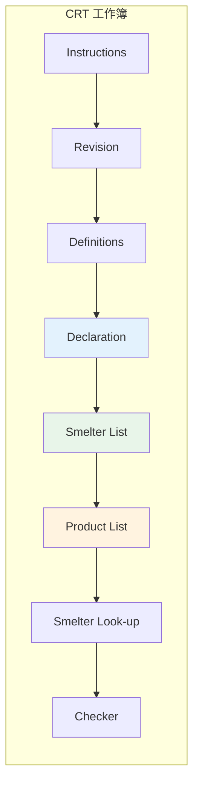
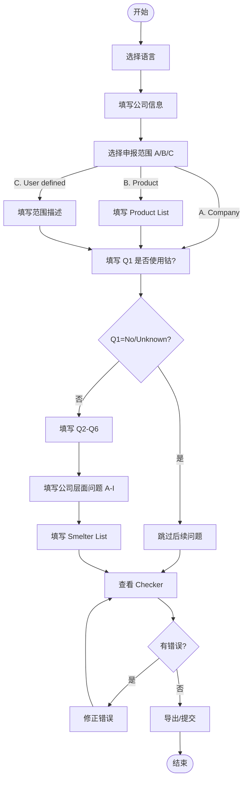
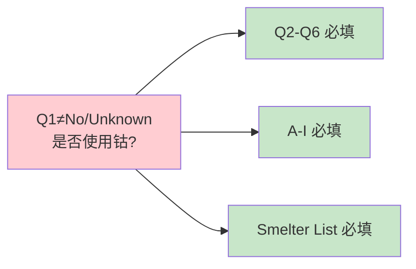
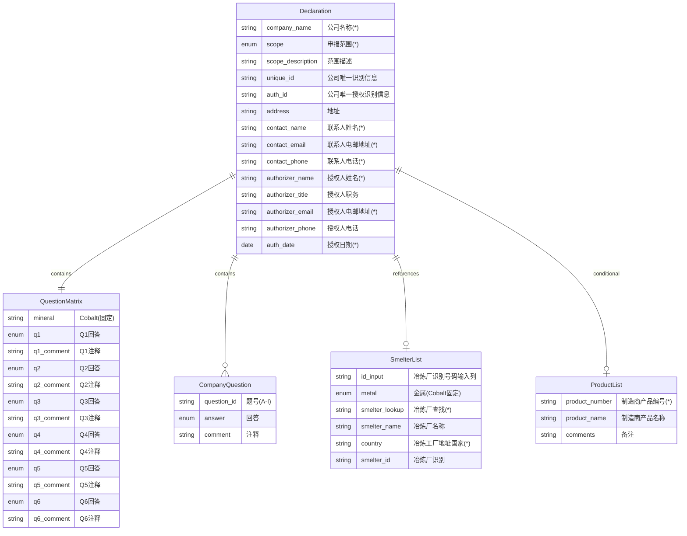
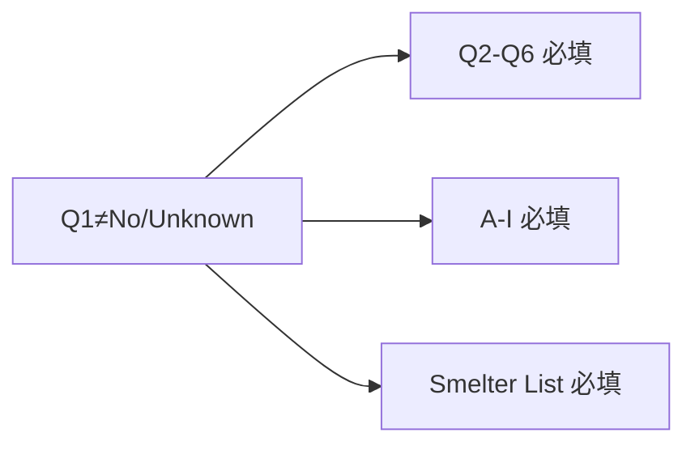
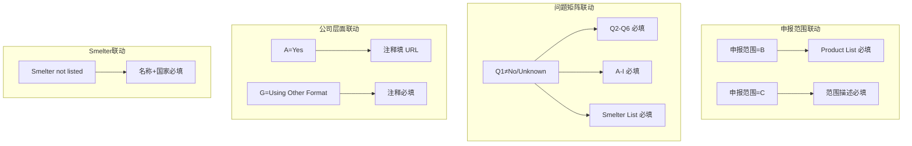

# CRT 产品需求文档

> Cobalt Reporting Template - 钴报告模板
> 版本范围：2.2 - 2.21

## 1. 模板概述

### 1.1 模板定位

CRT（Cobalt Reporting Template）是 RMI 创建的免费标准化模板，专门用于钴(Cobalt)供应链信息披露。主要特点：

- **披露对象**：钴（Cobalt）单一矿种
- **使用场景**：企业向客户/监管机构披露钴供应链信息
- **特殊说明**：若企业为钴冶炼/精炼厂，建议在 Smelter List 填写本公司信息
- **与 EMRT 关系**：CRT 专注于钴，EMRT 覆盖更广泛的扩展矿产

### 1.2 版本演进

```mermaid
timeline
    title CRT 版本演进
    : 2.2 基线版本
    : 2.21 新增 Q2/G 选项
```

### 1.3 核心功能矩阵

| 功能模块 | 2.2 | 2.21 |
|---------|-----|------|
| Declaration | ✓ | ✓ |
| 问题矩阵 Q1-Q6 | ✓ | ✓ |
| 公司层面问题 A-I | ✓ | ✓ |
| Smelter List | ✓ | ✓ |
| Smelter Look-up | ✓ | ✓ |
| Product List | ✓ | ✓ |
| Q2 新选项 | - | DRC or adjoining countries only |
| G 新选项 | - | Yes, Using Other Format (Describe) |

## 2. 信息架构

### 2.1 页面/Tab 结构



> 注：CRT 的 Tab 顺序与 CMRT/EMRT 略有不同，Instructions 在 Revision 之前。产品 UI 顺序以 **Checker 固定最后** 为准；Smelter Look-up 为数据支撑表，不参与 Tab 顺序。

### 2.2 页面功能说明

| 页面 | 功能 |
|-----|------|
| Instructions | 填写指南（首页） |
| Revision | 版本信息 |
| Definitions | 术语定义 |
| **Declaration** | 公司信息 + 问题矩阵 Q1-Q6 + 公司层面问题 A-I |
| **Smelter List** | 钴冶炼厂清单 |
| **Product List** | 产品清单 |
| Checker | 校验结果 |
| Smelter Look-up | 数据支撑表 |

### 2.3 填写说明要点（Excel Instructions 对齐）

- **英文作答**：模板要求英文作答，产品仅提示不强制（见 `00-overview.md` 3.4）。
- **日期格式**：`DD-MMM-YYYY`，范围口径见 `00-overview.md` 3.3。
- **文件名示例**：`companyname-date.xlsx`（date as `YYYY-MM-DD`，见 `00-overview.md` 3.3.1）。
- **术语口径**：CAHRA 等定义见 `00-overview.md` 2.1。

## 3. 用户流程

### 3.1 主流程图



### 3.2 问题联动逻辑



### 3.3 角色视角

| 角色 | 操作 |
|-----|------|
| 供应商/回复方 | 填写 Declaration、Smelter List、Product List；提交给采购方 |
| 采购方/审核方 | 查看提交内容；复核 Checker 结果；对齐模板版本 |

## 4. 数据模型

### 4.1 实体关系图



### 4.2 Declaration 公司信息字段

| 字段 | 必填 | 类型 | 说明 |
|-----|------|------|------|
| 请选择你的语言 | 否 | 下拉 | English / 中文 / 日本語 / 한국어 |
| 公司名称（*） | 是 | 文本 | Legal Name，不得使用缩写 |
| 申报范围或种类 (*) | 是 | 下拉 | A. Company / B. Product / C. User defined |
| 范围描述 | 条件 | 文本 | 申报范围=C 时必填 |
| 公司唯一识别信息 | 否 | 文本 | |
| 公司唯一授权识别信息 | 否 | 文本 | |
| 地址 | 否 | 文本 | |
| 联系人姓名 (*) | 是 | 文本 | |
| 联系人电邮地址 (*) | 是 | 文本 | 无邮箱可填 `not available` |
| 联系人电话 (*) | 是 | 文本 | |
| 授权人姓名 (*) | 是 | 文本 | 不可填 `same` 等占位 |
| 授权人职务 | 否 | 文本 | |
| 授权人电邮地址 (*) | 是 | 文本 | |
| 授权人电话 | 否 | 文本 | |
| 授权日期 (*) | 是 | 日期 | DD-MMM-YYYY，范围 31-Dec-2006 ~ 31-Mar-2026 |

### 4.3 根据上述指明的申报范围回答下列问题 1 - 6

CRT 仅针对 **Cobalt（钴）** 单一矿种。

| 问题 | 题干 | 2.2 回答选项 | 2.21 版本差异 | 依赖 |
|-----|------|-------------|--------------|------|
| **Q1** | 是否在产品或生产流程中有意添加或使用任何钴？ | Yes / No / Unknown | 无 | 无 |
| **Q2** | 贵公司供应链中是否有冶炼厂从受冲突影响和高风险地区采购钴？（《经合组织尽职调查指南》，参见定义选项卡） | **Yes / No / Unknown / DRC or adjoining countries only** | 无 | Q1≠No/Unknown |
| **Q3** | 是否 100% 的钴来自回收料或报废料资源？ | Yes / No / Unknown | 无 | Q1≠No/Unknown |
| **Q4** | 百分之多少的相关供应商已对贵公司的供应链调查提供答复？ | 1 / Greater than 90% / Greater than 75% / Greater than 50% / 50% or less / None | 无 | Q1≠No/Unknown |
| **Q5** | 您是否识别出为贵公司的供应链供应钴的所有冶炼厂？ | Yes / No / Unknown | 无 | Q1≠No/Unknown |
| **Q6** | 贵公司收到的所有适用冶炼厂信息是否已在此申报中报告？ | Yes / No / Unknown | 无 | Q1≠No/Unknown |

**交互规则补充**：
- Q1=No/Unknown → Q2-Q6 置灰、禁用并清空
- Q1=No/Unknown 时公司层面问题 A-I 为选填（不禁用，Excel 为灰底提示）
- A=Yes / G=Using Other Format 时出现的注释输入框为必填，使用黄色底色提示

**联动规则**：



### 4.4 从公司层面来回答以下问题

CRT 的公司层面问题比 CMRT/EMRT 更多（A-I 共 9 题），更侧重 OECD 尽职调查指南和童工问题。

| 题号 | 题干 | 回答选项 | 条件/版本差异 |
|-----|------|---------|-------------|
| **A** | 贵公司是否制定了可公开查阅的钴采购政策？ | Yes / No | Yes 时注释填 URL |
| **B** | 贵公司的政策是否至少涵盖《经合组织尽职调查指南》附录二《示范政策》中的所有风险以及童工问题的最恶劣形式？ | Yes / No | |
| **C** | 贵公司是否针对上述指明申报范围中的钴实施了尽职调查措施？ | Yes / No | |
| **D** | 贵公司是否要求供应商按照《经合组织尽职调查指南》针对钴供应链实施尽职调查？ | Yes / No | |
| **E** | 贵公司是否要求贵公司的直接供应商从尽职调查实践经独立第三方审计计划验证过的冶炼厂采购钴？ | Yes / No | |
| **F** | 贵公司是否要求供应商的尽职调查实践至少涵盖《经合组织尽职调查指南》附录二《示范政策》中的所有风险以及童工问题的最恶劣形式？ | Yes / No | |
| **G** | 贵公司是否针对相关供应商进行钴供应链调查？ | Yes, CRT / **Yes, Using Other Format (Describe)** / No | "Using Other Format" 时注释必填 |
| **H** | 贵公司是否会根据预期审核从供应商处收到的尽职调查信息？ | Yes / No | |
| **I** | 贵公司的审核流程是否包括纠错行动管理？ | Yes / No | |

### 4.5 Smelter List 字段表

| 字段 | 必填 | 输入方式 | 说明 |
|-----|------|---------|------|
| 冶炼厂识别号码输入列 | 否 | 手动 | 有值时触发自动填充 |
| 金属 (*) | 是 | 下拉 | **固定为 Cobalt**（表头误标"金属 l (*)"） |
| 冶炼厂查找 (*) | 是 | 下拉 | 冶炼厂目录 + Smelter not listed + Smelter not yet identified |
| 冶炼厂名称 | 条件 | 自动/手动 | Not listed 时必填 |
| 冶炼工厂地址（国家） (*) | 条件 | 自动/手选 | Not listed 时必选；not yet identified=Unknown |
| 冶炼厂识别 | 否 | 自动 | |
| 冶炼厂出处识别号 | 否 | 自动 | |
| 冶炼工厂地址（街道/城市/州省） | 否 | 自动 | |
| 冶炼厂联系名称/电邮 | 否 | 手动 | |
| 建议的后续步骤 | 否 | 手动 | |
| 矿井名称/国家 | 否 | 手动 | |
| 100% 回收料？ | 否 | 下拉 | Yes / No / Unknown |
| 注释 | 否 | 手动 | |

**系统列**：
- Standard Smelter Name
- Country Code / State Province Code
- Smelter not yet identified / Smelter Not Listed
- Unknown

**Smelter not yet identified 行为**：

| 字段 | 值 |
|-----|-----|
| Standard Smelter Name | Unknown |
| Country | Unknown |

### 4.6 Product List 字段表

| 字段 | 必填 | 说明 |
|-----|------|------|
| 制造商产品编号 (*) | 是 | 申报范围=B 时必填 |
| 制造商产品名称 | 否 | |
| 备注 | 否 | |

## 5. 校验规则

### 5.1 Checker 必填项（F=1）

| 分类 | 必填项 |
|-----|--------|
| 公司信息 | 公司名称、申报范围或种类、联系人姓名/电邮/电话、授权人姓名/电邮、授权日期（Scope=C 需范围描述） |
| 问题矩阵 | Q1-Q6（钴） |
| 公司层面问题 | A-I 全部 |
| Smelter List | Smelter List - Cobalt |

> 公司信息区域另含可选字段：公司唯一识别信息、公司唯一授权识别信息、地址、授权人职务、授权人电话（非 Checker 必填）。

### 5.2 条件必填规则



### 5.3 校验规则清单

| 规则ID | 触发条件 | 校验内容 | 提示类型 |
|--------|---------|---------|---------|
| C001 | 申报范围=B | Product List 至少一行 | 错误 |
| C002 | 申报范围=C | 范围描述不为空 | 错误 |
| C003 | Q1≠No/Unknown | Q2-Q6 必填 | 错误 |
| C004 | Q1≠No/Unknown | A-I 必填 | 错误 |
| C005 | A=Yes | The URL in the comment field | 错误 |
| C006 | G=Using Other Format | 注释必填 | 错误 |
| C007 | Smelter not listed | 冶炼厂名称+国家必填 | 错误 |
| C008 | Q1≠No/Unknown | Smelter List 必填 | 错误 |
| C010 | 联系人/授权人邮箱 | 必须包含 `@` | 错误 |

> 备注：模板 Checker 只有 error/pass；历史“提示”类规则（如名称/国家含“!”、识别号码不一致）不在 Checker 中，原型不实现。

### 5.4 Checker 展示说明

- **展示顺序**：按 Excel Checker 的出现顺序展示：公司信息 → 问题矩阵（Q1→Q6）→ 公司层面问题（A→I）→ Product List → Smelter List。
- **显示内容**：错误项仅显示所属模块标题（公司信息 / 根据上述指明的申报范围回答下列问题 1 - 6 / 从公司层面来回答以下问题 / 冶炼厂清单 等），不展示规则ID或问号提示。

### 5.4 Checker 特殊规则

**CRT 2.2 Checker A57 规则**：

- 位置：A57（Smelter List - Cobalt）
- 规则类型：cfExt（条件格式扩展）
- 触发条件：当 Smelter List 的冶炼厂查找列非全空时触发高亮
- 公式：`COUNTBLANK('Smelter List'!C5:C2498) <> ROWS * COLUMNS`
- 注意：openpyxl 可能无法解析 cfExt 规则，需人工核验样式表现
- **2.21 修正**：同一规则以常规 conditionalFormatting 存在，可正常解析

## 6. 版本差异

### 6.1 版本差异对照表

| 变更项 | 2.2 | 2.21 |
|-------|-----|------|
| Q2 选项 | Yes / No / Unknown | + **DRC or adjoining countries only** |
| G 选项 | Yes, CRT / No | + **Yes, Using Other Format (Describe)** |
| Checker A57 | cfExt（openpyxl难解析） | 常规 conditionalFormatting |
| Smelter List 金属下拉来源 | 固定 Cobalt | 固定 Cobalt |

### 6.2 关键变更说明

#### 2.2 → 2.21

1. **Q2 新增选项**：
   - 原有：Yes / No / Unknown
   - 新增：**DRC or adjoining countries only**（仅刚果民主共和国或邻国）

2. **G 题新增选项**：
   - 原有：Yes, CRT / No
   - 新增：**Yes, Using Other Format (Describe)**
   - 选择此项时注释必填

3. **Checker 规则修正**：
   - 2.2 的 A57 使用 cfExt，解析困难
   - 2.21 改为常规条件格式，解析正常

## 7. 导出规范

### 7.1 Excel 列映射

| 页面 | 说明 |
|-----|------|
| Declaration | 按模板布局 |
| Smelter List | 含系统列 |
| Product List | 制造商产品编号/名称/备注 |

### 7.2 系统列

- Standard Smelter Name
- Country Code / State Province Code
- Smelter not yet identified / Smelter Not Listed
- Unknown

## 8. 实现注意事项

1. **单一矿种**：CRT 仅针对 Cobalt，金属下拉固定
2. **表头误标**：Smelter List "金属 l (*)" 为误标，UI 可修正
3. **Q1 核心联动**：Q1≠No/Unknown 触发 Q2-Q6、A-I、Smelter List 全部必填
4. **A 与 G 注释**：A=Yes 需 URL，G=Using Other Format 需说明
5. **童工问题**：B/F 题涉及 OECD 附录二和童工问题，为 CRT 特有
6. **Checker cfExt**：2.2 版本需注意 A57 规则的特殊处理
7. **离开确认提示**：任意表单字段有修改时，关闭/刷新/导航需显示浏览器原生 beforeunload，对话框文案为“您有未保存的数据，确定要离开吗？”
8. **UX 交互规范**：对齐 CMRT 9.x（顶栏移除 tabs、进度指示器可点击切页、页底上一页/下一页、Review 提交 Modal、全局错误提示/必填提示/禁用遮罩/定位高亮/Checker 分组/通过项折叠/Loading），其中进度步骤按 CRT 页面顺序：Declaration → Smelter → Product → Checker
9. **Checker 统计卡片**：不展示“通过/错误/完成度”统计卡片，保留进度条与错误/通过列表

## 9. 与其他模板对比

| 对比项 | CRT | CMRT | EMRT |
|-------|-----|------|------|
| 矿种 | 钴（固定） | 3TG（固定） | 6种（2.0+动态） |
| 问题数量 | Q1-Q6 | Q1-Q8 | Q1-Q7 |
| 公司层面问题 | A-I（9题） | A-H（8题） | A-G（7题） |
| OECD/童工问题 | B/D/F 明确 | 无 | 无 |
| Mine List | 无 | 无 | 2.0+ 有 |

## 10. 参考文档

- [项目概述](./00-overview.md) - 通用规则与术语
- [跨模板对比](./05-cross-template.md) - 与其他模板的差异
