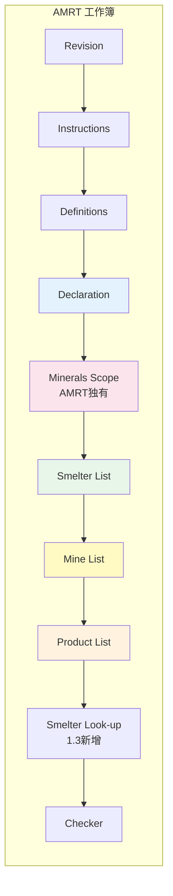
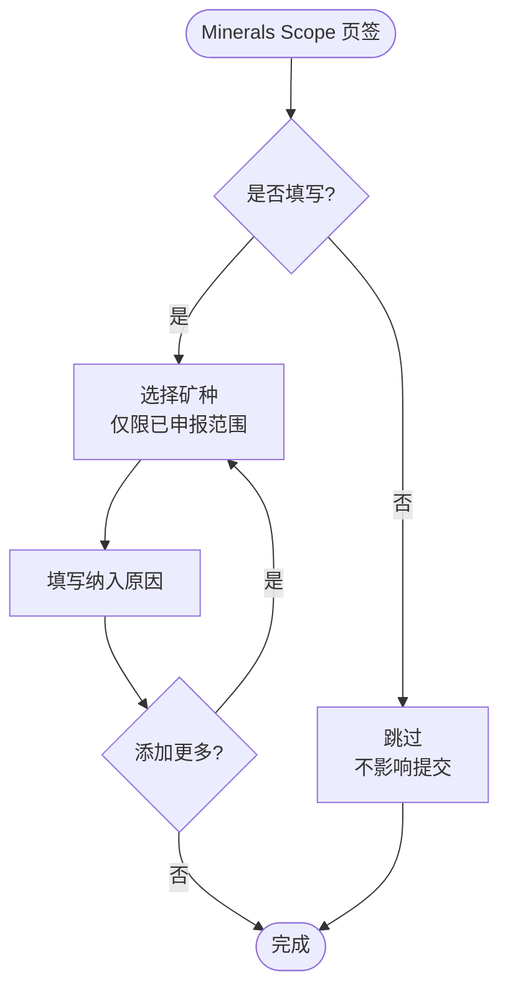
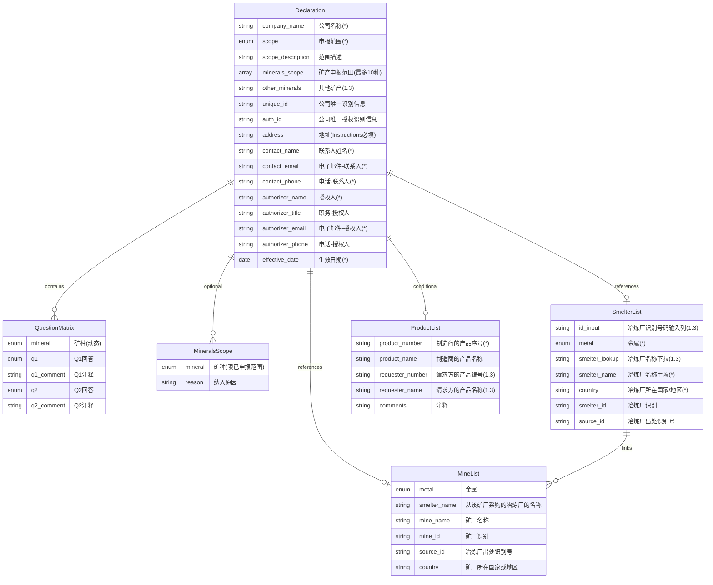
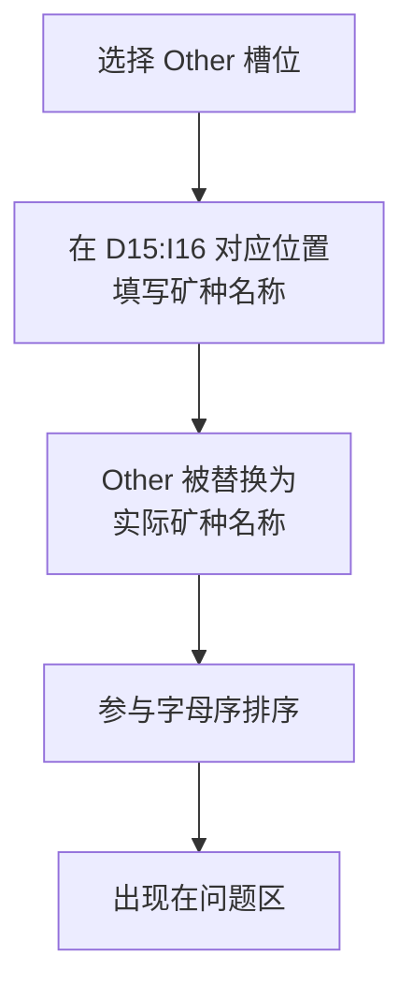
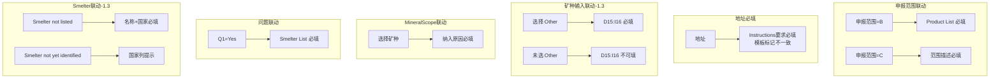
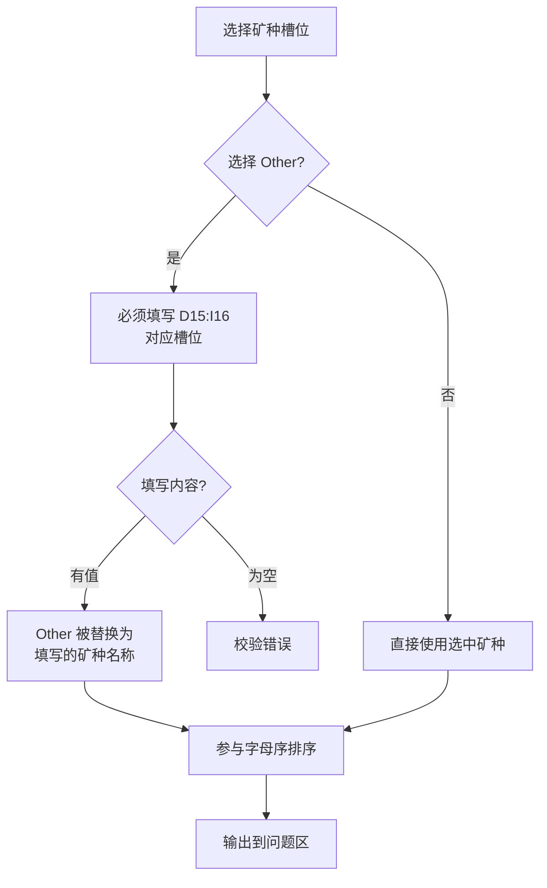

# AMRT 产品需求文档

> Additional Minerals Reporting Template - 其他矿产报告模板
> 版本范围：1.1 - 1.3

## 1. 模板概述

### 1.1 模板定位

AMRT（Additional Minerals Reporting Template）是 RMI 创建的免费标准化模板，用于披露 CMRT/EMRT 覆盖范围之外的其他矿产供应链信息。主要特点：

- **披露对象**：CMRT/EMRT 未覆盖的其他矿产
- **排除矿种**：3TG（钽/锡/金/钨）、钴、铜、石墨、锂、云母、镍
- **使用场景**：企业向客户/监管机构披露其他矿产供应链信息
- **特殊说明**：若企业为冶炼/精炼/加工厂，建议在 Smelter List 填写本公司信息
- **演进背景**：AMRT 源自 Pilot Reporting Template (PRT)，后更名为 Additional Minerals Reporting Template

### 1.2 版本演进

```mermaid
timeline
    title AMRT 版本演进
    : 1.1 初始版本<br/>自由输入矿种(预填7项)<br/>无 Smelter Look-up
    : 1.2 文案更新<br/>PRT→AMRT
    2025-10-17 : 1.3 重大升级<br/>下拉选择矿种(含 Other)<br/>新增 Smelter Look-up<br/>新增请求方字段
```

### 1.3 核心功能矩阵

| 功能模块 | 1.1 | 1.2 | 1.3 |
|---------|-----|-----|-----|
| Declaration | ✓ | ✓ | ✓ |
| 矿产申报范围 | 自由输入(预填7矿种) | 自由输入(预填7矿种) | 下拉选择(列表不同) |
| 问题矩阵 Q1-Q2 | ✓ | ✓ | ✓ |
| **Minerals Scope** | ✓ | ✓ | ✓ |
| Smelter List | ✓ | ✓ | ✓ |
| **Smelter Look-up** | - | - | ✓ |
| **Mine List** | ✓ | ✓ | ✓ |
| Product List | ✓ | ✓ | ✓ |
| 请求方字段 | - | - | ✓ |

### 1.4 AMRT 独有特性

AMRT 相比其他模板有以下独特特性：

1. **Minerals Scope 页签**：可选填写矿物范围说明（其他模板无此页签）
2. **动态矿种输入**：1.1/1.2 自由输入（预填 7 矿种），1.3 下拉选择（含 Other，列表不同）
3. **最多 10 种矿种**：模板文字要求限制
4. **仅 Q1-Q2**：问题数量最少（其他模板 Q1-Q6/Q7/Q8）
5. **无公司层面问题**：A-H/A-I 在 AMRT 中不存在
6. **地址必填**：按 Instructions 要求必填（模板内部标记不一致）

## 2. 信息架构

### 2.1 页面/Tab 结构



> 注：**1.1/1.2** 的实际模板顺序为 **Instructions 在 Revision 之前**；**1.3** 起调整为 **Revision 在 Instructions 之前**。上图以 1.3 为主。产品 UI 顺序以 **Checker 固定最后** 为准；Smelter Look-up 为数据支撑表，不参与 Tab 顺序。

### 2.2 页面功能说明

| 页面 | 版本 | 功能 |
|-----|------|------|
| Revision | 全版本 | 版本信息 |
| Instructions | 全版本 | 填写指南 |
| Definitions | 全版本 | 术语定义 |
| **Declaration** | 全版本 | 公司信息 + 矿产申报范围 + 问题矩阵 Q1-Q2 |
| **Minerals Scope** | 全版本 | 矿物范围说明（可选但建议填写） |
| **Smelter List** | 全版本 | 冶炼厂清单 |
| **Mine List** | 全版本 | 矿厂清单 |
| **Product List** | 全版本 | 产品清单 |
| Checker | 全版本 | 校验结果 |
| **Smelter Look-up** | 1.3 | 冶炼厂查找表 |

### 2.3 填写说明要点（Excel Instructions 对齐）

- **英文作答**：模板要求英文作答，产品仅提示不强制（见 `00-overview.md` 3.4）。
- **日期格式**：`DD-MMM-YYYY`，范围口径见 `00-overview.md` 3.3。
- **文件名示例**：`companyname-date.xls`（date as `YYYY-MM-DD`，见 `00-overview.md` 3.3.1）。
- **术语口径**：CAHRA 等定义见 `00-overview.md` 2.1。

## 3. 用户流程

### 3.1 主流程图

```mermaid
flowchart TD
    Start([开始]) --> SelectLang[选择语言]
    SelectLang --> FillCompany[填写公司信息<br/>含地址必填]
    FillCompany --> SelectScope[选择申报范围 A/B/C]
    
    SelectScope --> |B. Product| FillProduct[填写 Product List]
    SelectScope --> |C. User defined| FillDesc[填写范围描述]
    SelectScope --> |A. Company| SelectMineral
    
    FillProduct --> SelectMineral
    FillDesc --> SelectMineral
    
    SelectMineral{版本?}
    SelectMineral --> |1.1/1.2| InputSelect12[自由输入矿种(预填7项)<br/>最多10种]
    SelectMineral --> |1.3| DropdownSelect[下拉选择矿种<br/>最多10种]
    
    InputSelect12 --> GenQ[生成问题矩阵]
    DropdownSelect --> OtherCheck{选择了 Other?}
    
    OtherCheck --> |是| FillOther[填写其他矿产名称]
    OtherCheck --> |否| GenQ
    FillOther --> GenQ
    
    GenQ[生成 Q1-Q2 问题行<br/>按字母序排列] --> FillQ[填写问题矩阵 Q1-Q2]
    
    FillQ --> FillSmelter[填写 Smelter List（Q1=Yes 时必填）]
    
    FillSmelter --> FillMine[填写 Mine List]
    FillMine --> FillMineralScope[填写 Minerals Scope<br/>强烈建议]
    
    FillMineralScope --> Review[查看 Checker]
    Review --> Fix{有错误?}
    Fix --> |是| FixError[修正错误]
    FixError --> Review
    Fix --> |否| Export[导出/提交]
    
    Export --> End([结束])
```

### 3.2 矿种输入差异流程

```mermaid
flowchart TD
    subgraph v11_12[1.1/1.2 自由输入(预填7矿种)]
        A1[自由输入矿种] --> A2[最多10种]
        A2 --> A3[模板预填默认列表<br/>可覆盖编辑]
    end
    
    subgraph v13[1.3 下拉选择]
        B1[从下拉列表选择] --> B2[最多10种]
        B2 --> B3[含 Other 选项]
        B3 --> B4{选择 Other?}
        B4 --> |是| B5[在 D15:I16 填写<br/>Other 矿种名称]
        B4 --> |否| B6[直接使用]
        B5 --> B7[Other 内容替代<br/>参与排序]
    end
```

### 3.3 Minerals Scope 填写流程



## 4. 数据模型

### 4.1 实体关系图



### 4.2 Declaration 公司信息字段

| 字段 | 必填 | 类型 | 说明 |
|-----|------|------|------|
| 请选择你的语言 | 否 | 下拉 | English / 中文 / 日本語 / 한국어 / Français / Deutsch |
| 公司名称（*） | 是 | 文本 | Legal Name，不得使用缩写 |
| 申报范围或种类 (*) | 是 | 下拉 | A. Company / B. Product / C. User defined |
| 范围描述 | 条件 | 文本 | 申报范围=C 时必填 |
| 选择/输入贵公司的矿产申报范围（最多10种） | 是 | 见版本差异 | 1.1/1.2: 自由输入（预填7矿种）<br/>1.3: 下拉选择 |
| 其他矿产（Other） | 条件 | 文本 | 仅1.3，选择Other时必填 |
| 公司唯一识别信息 | 否 | 文本 | |
| 公司唯一授权识别信息 | 否 | 文本 | |
| **地址** | **是(Instructions)** | 文本 | **模板内部不一致：Instructions必填，但Declaration未标星、Checker未列** |
| 联系人姓名 (*) | 是 | 文本 | |
| 电子邮件 - 联系人 (*) | 是 | 文本 | 无邮箱可填 `not available` |
| 电话 - 联系人 (*) | 是 | 文本 | |
| 授权人 (*) | 是 | 文本 | 不可填 `same` 等占位 |
| 职务 - 授权人 | 否 | 文本 | |
| 电子邮件 - 授权人 (*) | 是 | 文本 | |
| 电话 - 授权人 | 否 | 文本 | |
| 生效日期 (*) | 是 | 日期 | DD-MMM-YYYY，范围 31-Dec-2006 ~ 31-Mar-2026 |

### 4.3 矿产申报范围（版本差异）

#### 1.1/1.2 自由输入（预填）

| 特性 | 说明 |
|-----|------|
| 输入方式 | 自由输入（单列） |
| Excel 文案 | **输入贵公司的矿产申报范围（最多 10 种）。该声明最多可包含 10 种矿物或金属。请用英文输入您的答案。** |
| 数量限制 | 最多10种（模板文字要求，产品强制） |
| 预填值 | 模板预填默认矿种（按 D12:I13 顺序）<br/>1.1: Aluminium / Copper / Lithium / Nickel / Silver / Chromium / Zinc<br/>1.2: 铝 / 铬 / 铜 / 锂 / 镍 / 银 / 锌 |
| 校验 | 无下拉限制（文本输入） |
| 排序 | 问题区按文本排序输出（Excel字符串比较逻辑） |

#### 1.3 下拉选择

| 特性 | 说明 |
|-----|------|
| 输入方式 | 下拉多选 |
| Excel 文案 | **选择贵公司的矿产申报范围（最多 10 种）。该声明最多可包含 10 种矿物或金属。如果矿物或金属未出现在列表中，请选择“其他”。**<br/>**如果您的矿产申报范围包括“其他”，请在此处输入其他矿产。**<br/>**注：问题 1 和 2 会自动填充精选的矿产，将按字母顺序列出。检查你的回复是否与相应的矿物相符。** |
| 数量限制 | 最多10种 |
| 可选矿种 | Aluminum / Iridium / Lime / Manganese / Palladium / Platinum / Rare Earth Elements / Rhodium / Ruthenium / Silver / Soda Ash / Zinc / **Other [specify below]** |
| Other 处理 | 选择Other后，需在D15:I16填写具体矿种名称；数量需匹配；Other内容替代参与排序 |
| 排序 | 按字母序自动排列（公式实现） |

**1.3 Other 逻辑**：
- 若选择 Other 但未填写 D15:I16，对应矿种**不进入排序/问题区**，Checker 仍会触发 A000/A005。



### 4.4 根据上述申报范围，回答以下 1 至 2 题

AMRT 仅有 **Q1-Q2** 两道题，是所有模板中问题最少的。

| 问题 | 题干 | 回答选项 | 依赖 |
|-----|------|---------|------|
| **Q1** | 是否在产品或生产流程中有意添加或使用任何特定矿产？ | Yes / No / Unknown / Not declaring | 无 |
| **Q2** | 已对贵公司供应链调查提供答复的相关供应商百分比是多少？ | 1 / Greater than 90% / Greater than 75% / Greater than 50% / 50% or less / None / Unknown / **Did not survey** | **可选（Checker 不强制）** |

**交互规则补充**：
- Q1=No/Unknown/Not declaring → 对应矿种 Q2 置灰/禁用并清空
- Q1 未选择或为 Yes → Q2 可填写（但 Checker 不强制）

**金属下拉来源**：
- Smelter/Mine List 的金属下拉来自 **已选矿种**（模板中为 listIndex2）。

**特殊规则**：

| Q2 回答 | 后续要求 |
|--------|---------|
| **1（显示为 100%）** | Instructions 提示需完整列出冶炼厂信息（非 Checker 强制） |
| **Did not survey** | Instructions 提示需在注释说明原因（非 Checker 强制） |

### 4.5 Minerals Scope 字段表（AMRT 独有）

| 字段 | 必填 | 说明 |
|-----|------|------|
| Select Minerals/Metals in Scope | 条件 | 下拉，来源于 listIndex（版本固定列表，不随 Declaration 选择联动） |
| Reasons for inclusion on the AMRT | 条件 | 填写纳入原因（选择矿种后必填） |

**说明**：
- 1.1 版本表头为 "Reasons for inclusion on the **PRT**"（模板原文沿用 PRT 字样）
- 1.2+ 版本改为 "Reasons for inclusion on the **AMRT**"
- Instructions 强烈建议先填写 Minerals Scope，再提交 AMRT 调查（提示，不强制）

### 4.6 Smelter List 字段表

| 字段 | 必填 | 输入方式 | 版本差异 |
|-----|------|---------|---------|
| 冶炼厂识别号码输入列 | 否 | 手动 | 仅1.3 |
| 金属 (*) | 是 | 下拉 | 来源于申报矿种 |
| 冶炼厂名称（下拉） (*) | 是 | 下拉 | 仅1.3，DV=SN（按金属过滤） |
| 冶炼厂名称（手填） (*) | 条件 | 手动 | 1.3: Smelter not listed时必填<br/>1.1/1.2: 单列手填 |
| 冶炼厂所在国家或地区 (*) | 是 | 下拉/手选 | 1.1/1.2: 必填列但条件格式未提示 |
| 冶炼厂识别 | 否 | 自动/手动 | 1.3自动，1.1/1.2手动 |
| 冶炼厂出处识别号 | 否 | 自动/手动 | 1.3自动，1.1/1.2手动 |
| 冶炼厂所在街道/城市/州省 | 否 | 手动 | |
| 冶炼厂联系人/电子邮件 | 否 | 手动 | |
| 建议的后续步骤 | 否 | 手动 | |
| 矿井名称/国家 | 否 | 手动 | |
| 100% 回收料？ | 否 | 下拉 | 1.1/1.2: Yes/No/Unknown<br/>1.3: Yes/No |
| 注释 | 否 | 手动 | |

**版本结构差异**：

| 版本 | Smelter Look-up | 冶炼厂名称列 | 列位置 |
|-----|----------------|-------------|--------|
| 1.1/1.2 | 无 | 单列手填 | 金属在A列 |
| 1.3 | 有 | 双列（下拉+手填） | 新增识别号码输入列，整体右移 |

**Smelter not yet identified 行为（1.3）**：

| 字段 | 值 |
|-----|-----|
| Standard Smelter Name | Unknown |
| Country | 空（触发提示） |

### 4.7 Mine List 字段表

| 字段 | 必填 | 输入方式 | 版本差异 |
|-----|------|---------|---------|
| 金属 | 条件 | 下拉 | 来源于申报矿种 |
| 从该矿厂采购的冶炼厂的名称 | 条件 | 1.3: 下拉（DV=SSLX）<br/>1.1/1.2: 手动 | 1.3 与 Smelter List 联动 |
| 矿厂(矿场)名称 | 否 | 手动 | 建议填写 |
| 矿厂识别（例如《CID》） | 否 | 手动 | |
| 冶炼厂出处识别号 | 否 | 手动 | |
| 矿厂所在国家或地区 | 条件 | 下拉 | 金属已选时必填提示 |
| 矿厂所在街道/城市/州省 | 否 | 手动 | |
| 矿厂联系人/电子邮件 | 否 | 手动 | |
| 建议的后续步骤 | 否 | 手动 | |
| 注释 | 否 | 手动 | |

**条件格式规则**：
- 金属已选 → 从该矿厂采购的冶炼厂的名称必填（标红）
- 金属已选 → 矿厂所在国家或地区必填（标红）
- 名称或国家包含 "!" → 触发提示
- 以上仅为条件格式提示，**Checker 无对应规则**

### 4.8 Product List 字段表

| 字段 | 必填 | 版本差异 |
|-----|------|---------|
| 制造商的产品序号 (*) | 是 | 全版本 |
| 制造商的产品名称 | 否 | 全版本 |
| 请求方的产品编号 | 否 | 1.3 新增 |
| 请求方的产品名称 | 否 | 1.3 新增 |
| 注释 | 否 | 全版本 |

## 5. 校验规则

### 5.1 Checker 必填项（F=1）

| 分类 | 必填项 |
|-----|--------|
| 公司信息 | 公司名称、申报范围或种类、联系人姓名/电邮/电话、授权人姓名/电邮、生效日期（Scope=C 需范围描述） |
| 矿产申报范围 | 至少选择1种矿产 |
| 问题矩阵 | 矿种已选时 **Q1 必填，Q2 可选** |
| Smelter List | **Q1=Yes 的矿种需至少一条 Smelter 记录**（同时校验 Smelter not listed 行必填项）<br/>Mine List **无 Checker 校验** |

> 备注：Instructions 中的补充要求仅作提示，强制校验以 Checker 为准

> 公司信息区域另含可选字段：公司唯一识别信息、公司唯一授权识别信息、授权人职务、授权人电话（地址在 Instructions 中标记必填但 Checker 未列）。

### 5.2 条件必填规则



**补充**：
- Q1=No/Unknown/Not declaring 时，Q2 对应矿种置灰（条件格式），不影响 Checker 结果

### 5.3 校验规则清单

| 规则ID | 触发条件 | 校验内容 | 提示类型 |
|--------|---------|---------|---------|
| A001 | 申报范围=B | Product List 至少一行 | 错误 |
| A002 | 申报范围=C | 范围描述不为空 | 错误 |
| A004 | 全版本 | 矿产申报范围 ≤10 种 | 错误 |
| A005 | 1.3 选择 Other | D15:I16 对应位置必填 | 错误 |
| A006 | 1.3 未选 Other | D15:I16 不可填 | 错误 |
| A007 | Q1=Yes | Smelter List 需包含对应矿种记录 | 错误 |
| A009 | Minerals Scope 选择矿种 | 纳入原因必填 | 错误 |
| A010 | 1.3 Smelter not listed | 冶炼厂名称+国家必填 | 错误 |
| A014 | 联系人/授权人邮箱 | 必须包含 `@` | 错误 |

> 备注：模板 Checker 只有 error/pass；历史“提示”类规则（如地址/Did not survey/“!”）不在 Checker 中，原型不实现。

### 5.4 Checker 展示说明

- **展示顺序**：按 Excel Checker 的出现顺序展示：公司信息 → 矿物范围 → 问题矩阵（Q1→Q2）→ Product List → Smelter List（Mine List 无 Checker 项）。
- **显示内容**：错误项仅显示所属模块标题（公司信息 / 根据上述申报范围，回答以下 1 至 2 题 / 冶炼厂清单 / 矿物范围 / 产品清单 等），不展示规则ID或问号提示。

### 5.4 模板内部不一致说明

| 字段/规则 | Instructions | Declaration/Checker | 产品执行 |
|----------|--------------|---------------------|---------|
| 地址 | **必填** | 未标星、未列入 Checker | 按 Checker 不强制 |
| Q1/Q2 | 需填写 | **Q1 必填、Q2 可选（Checker 不强制）** | 按 Checker 处理 |
| Smelter List | 需填写 | **Q1=Yes 时 Checker 要求覆盖对应矿种** | 按 Checker 处理（Mine List 无 Checker） |
| 1.1/1.2 国家/地区 | 必填列 | 条件格式未单独提示 | 按必填处理 |

## 6. 版本差异

### 6.1 版本差异对照表

| 变更项 | 1.1 | 1.2 | 1.3 |
|-------|-----|-----|-----|
| 矿产申报范围 | 自由输入(预填7矿种) | 自由输入(预填7矿种) | 下拉选择(列表不同) |
| 预填矿种语言 | 英文 | 中文 | 下拉（英文） |
| Other 支持 | 无 | 无 | 有 |
| 排序方式 | 文本排序 | 文本排序 | 字母序（公式） |
| Smelter Look-up | 无 | 无 | 有 |
| 冶炼厂名称列 | 单列手填 | 单列手填 | 双列（下拉+手填） |
| 识别号码输入列 | 无 | 无 | 有 |
| 请求方字段 | 无 | 无 | 有 |
| Minerals Scope 表头 | PRT 字样 | AMRT 字样 | AMRT 字样 |
| 100%回收料选项 | Yes/No/Unknown | Yes/No/Unknown | Yes/No |
| Combined 列 | 无 | 无 | 有 |
| Smelter/Mine 金属下拉来源 | 已选矿种（listIndex2，Declaration Z30:Z39） | 同 1.1 | 已选矿种（listIndex2，Declaration Z31:Z40） |

### 6.2 关键变更说明

#### 1.1 → 1.2
- **Minerals Scope 表头更新**：从 "Reasons for inclusion on the **PRT**" 改为 "Reasons for inclusion on the **AMRT**"
- 其余结构基本一致

#### 1.2 → 1.3（重大升级）

1. **矿产申报范围调整**：
   - 下拉列表调整（矿种清单变化）
   - 新增 "Other [specify below]" 选项
   - 选择 Other 后需在 D15:I16 填写具体名称

2. **排序实现**：
   - 问题区按字母序输出（公式实现）
   - Other 内容替代后参与排序

3. **Smelter List 重大调整**：
   - 新增 Smelter Look-up 工作表
   - 冶炼厂名称拆分为下拉/手填双列
   - 新增冶炼厂识别号码输入列
   - 列位置整体右移
   - 新增 Smelter not listed / not yet identified 逻辑

4. **Mine List 增强**：
   - "从该矿厂采购的冶炼厂的名称"改为下拉，与 Smelter List 联动

5. **Product List 新增**：
   - 请求方的产品编号/名称

6. **范围排除说明**：
   - Instructions 明确：申报范围不包括 3TG、钴、铜、石墨、锂、云母、镍
   - 产品执行：通过下拉选项与 Other 控制范围，不额外阻断

### 6.3 1.3 Other 逻辑详解



**DV 提示文案（1.3）**：
- 矿产下拉：`promptTitle="Select Minerals/Metals"; prompt="Please select up to 10 minerals or metals for the Declaration... If mineral or metal doesn't appear on the list, select "Other"."`
- Other 校验：`promptTitle="Enter Other Minerals/Metals"; prompt="If Other was selected in cell X, enter the mineral/metal here."; error="You must select Other in cell X to enter a mineral/metal in this cell."`

## 7. 导出规范

### 7.1 Excel 列映射

| 页面 | 版本 | 说明 |
|-----|------|------|
| Declaration | 全版本 | 按模板布局 |
| Minerals Scope | 全版本 | 矿种+原因 |
| Smelter List | 1.3 | 含双列名称、系统列 |
| Mine List | 全版本 | 含系统列 |
| Product List | 1.3 | 含请求方字段 |

### 7.2 系统列

**Smelter List**：
- Standard Smelter Name (1.1/1.2 标注 Not in use，1.3 正常)
- Country Code / State Province Code
- Missing Entry Check / Smelter Counter
- Smelter not yet identified / Smelter Not Listed (1.3)
- Combined Metal / Combined Smelter (1.3)
- 未知 (1.1/1.2)

**Mine List**：
- Country Code / State Province Code
- Missing Entry Check / Smelter Counter

## 8. 实现注意事项

1. **地址必填**：按 Instructions 要求必填，提示用户（模板内部不一致）
2. **矿种限制**：强制最多 10 种（模板文字要求）
3. **版本判断**：1.1/1.2 与 1.3 差异很大，需分支处理
4. **Other 逻辑**（1.3）：选择 Other 后必须填写对应 D15:I16，且数量匹配
5. **排序差异**：1.1/1.2 文本排序，1.3 字母序（公式）
6. **Smelter List 结构**（1.3）：双列名称，列位右移
7. **Checker 口径**：强制校验以 Checker 为准
8. **Q2=1**：Instructions 提示需完整列出冶炼厂（非强制）
9. **Q2=Did not survey**：Instructions 提示需在注释说明原因（非强制）
10. **Minerals Scope**：强烈建议填写，但不强制
11. **离开确认提示**：任意表单字段有修改时，关闭/刷新/导航需显示浏览器原生 beforeunload，对话框文案为“您有未保存的数据，确定要离开吗？”
12. **UX 交互规范**：对齐 CMRT 9.x（顶栏移除 tabs、进度指示器可点击切页、页底上一页/下一页、Review 提交 Modal、全局错误提示/必填提示/禁用遮罩/定位高亮/Checker 分组/通过项折叠/Loading），其中进度步骤按 AMRT 页面顺序：Declaration → Minerals Scope → Smelter → Mine → Product → Checker
13. **Checker 统计卡片**：不展示“通过/错误/完成度”统计卡片，保留进度条与错误/通过列表

## 9. 与其他模板对比

| 对比项 | AMRT | CMRT | EMRT | CRT |
|-------|------|------|------|-----|
| 矿种范围 | 其他矿种 | 3TG | 钴等6种 | 钴 |
| 矿种选择 | 动态（1.3下拉） | 固定 | 2.0+动态 | 固定 |
| 问题数量 | Q1-Q2 | Q1-Q8 | Q1-Q7 | Q1-Q6 |
| 公司层面问题 | **无** | A-H | A-G | A-I |
| Minerals Scope | **有** | 无 | 无 | 无 |
| Mine List | 有 | 无 | 2.0+ | 无 |
| Smelter Look-up | 1.3有 | 有 | 有 | 有 |
| 地址必填 | **是(Instructions)** | 否 | 否 | 否 |

## 10. 参考文档

- [项目概述](./00-overview.md) - 通用规则与术语
- [跨模板对比](./05-cross-template.md) - 与其他模板的差异
