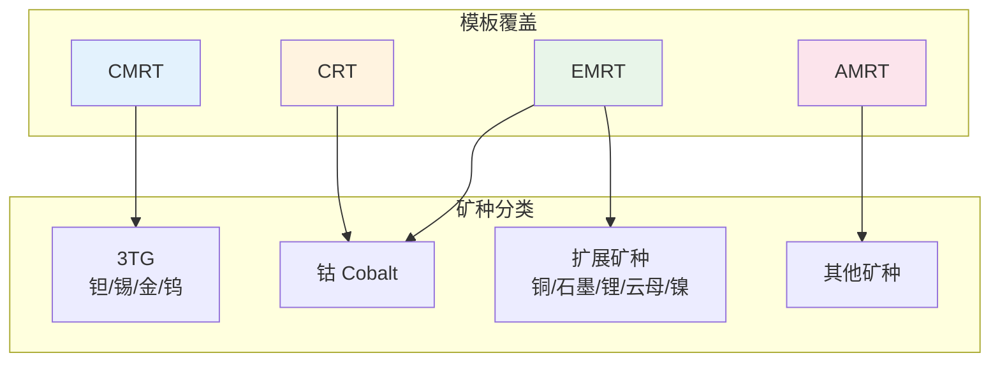
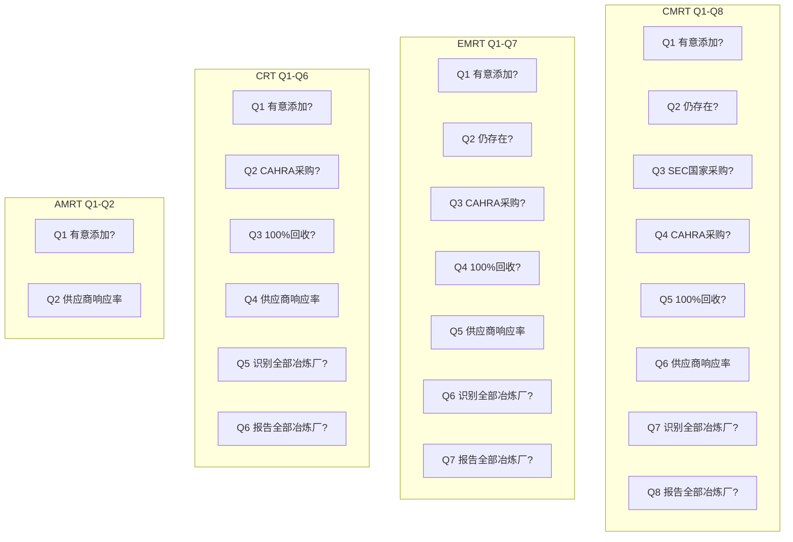
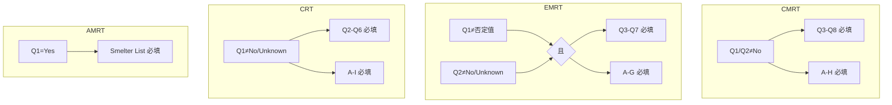
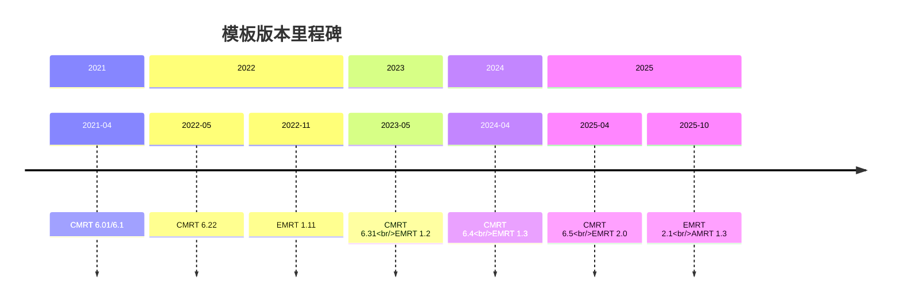

# 跨模板对比与通用组件

> 本文档整合四种模板（CMRT/EMRT/CRT/AMRT）的差异对比和通用组件说明

## 1. 模板定位对比

### 1.1 矿种覆盖范围



### 1.2 模板功能矩阵

| 功能 | CMRT | EMRT | CRT | AMRT |
|-----|------|------|-----|------|
| 矿种类型 | 3TG（固定） | 6种（2.0+动态） | 钴（固定） | 其他（动态） |
| 问题数量 | Q1-Q8 | Q1-Q7 | Q1-Q6 | Q1-Q2 |
| 公司层面问题 | A-H（8题） | A-G（7题） | A-I（9题） | **无** |
| Smelter List | 有 | 有 | 有 | 有 |
| Mine List | 无 | 2.0+ 有 | 无 | 有 |
| Minerals Scope | 无 | 无 | 无 | **有** |
| Smelter Look-up | 有 | 有 | 有 | 1.3 有 |
| Product List | 有 | 有 | 有 | 有 |

## 2. 页面/Tab 结构对比

### 2.1 结构对比图

```mermaid
graph LR
    subgraph CMRT[CMRT]
        CR[Revision] --> CI[Instructions] --> CD[Definitions] --> CDecl[Declaration] --> CS[Smelter List] --> CP[Product List] --> CL[Look-up] --> CC[Checker]
    end
    
    subgraph EMRT[EMRT 2.0+]
        ER[Revision] --> EI[Instructions] --> ED[Definitions] --> EDecl[Declaration] --> ES[Smelter List] --> EM[Mine List] --> EP[Product List] --> EL[Look-up] --> EC[Checker]
    end
    
    subgraph CRT[CRT]
        TI[Instructions] --> TR[Revision] --> TD[Definitions] --> TDecl[Declaration] --> TS[Smelter List] --> TP[Product List] --> TL[Look-up] --> TC[Checker]
    end
    
    subgraph AMRT[AMRT]
        AR[Revision] --> AI[Instructions] --> AD[Definitions] --> ADecl[Declaration] --> AMS[Minerals Scope] --> AS[Smelter List] --> AM[Mine List] --> AP[Product List] --> AL[Look-up] --> AC[Checker]
    end
```



> 注：产品 UI 顺序统一为 **Checker 固定最后**；Smelter Look-up 为数据支撑表，不参与 Tab 顺序。

### 2.2 独有页签说明

| 页签 | 模板 | 说明 |
|-----|------|------|
| Mine List | EMRT 2.0+ / AMRT | 矿厂清单 |
| Minerals Scope | AMRT | 矿物范围说明（可选） |

### 2.3 Tab 顺序差异

| 位置 | CMRT | EMRT | CRT | AMRT |
|-----|------|------|-----|------|
| 第1个 | Revision | **1.x/2.0：Instructions**<br/>2.1：Revision | **Instructions** | **1.1/1.2：Instructions**<br/>1.3：Revision |
| 第2个 | Instructions | **1.x/2.0：Revision**<br/>2.1：Instructions | Revision | **1.1/1.2：Revision**<br/>1.3：Instructions |
| 最后一个 | **Checker** | **Checker** | **Checker** | **Checker** |

> 注：CRT 始终为 Instructions 在 Revision 之前；EMRT 与 AMRT 存在版本分歧（见表）。产品 UI 顺序以 Checker 最后为准。

## 3. 数据结构对比

### 3.1 Declaration 公司信息

所有模板的公司信息字段基本一致，主要差异如下：

| 字段 | CMRT | EMRT | CRT | AMRT |
|-----|------|------|-----|------|
| 地址必填 | 否 | 否 | 否 | **是(Instructions)** |
| 联系人电子邮件字段名 | 电子邮件-联系人 | 联系人电邮地址 | 联系人电邮地址 | 电子邮件-联系人 |
| 授权人字段名 | 授权人 | 授权人姓名 | 授权人姓名 | 授权人 |
| 日期字段名 | 生效日期 | 授权日期 | 授权日期 | 生效日期 |

### 3.2 矿产申报范围

| 模板 | 版本 | 输入方式 | 可选矿种 |
|-----|------|---------|---------|
| CMRT | 全版本 | 固定 | 钽/锡/金/钨 |
| EMRT | 1.x | 固定 | Cobalt/Mica |
| EMRT | 2.0+ | 动态下拉 | Cobalt/Copper/Graphite/Lithium/Mica/Nickel |
| CRT | 全版本 | 固定 | Cobalt |
| AMRT | 1.1/1.2 | 自由输入 | 任意（最多10种） |
| AMRT | 1.3 | 动态下拉 | 预设列表 + Other |

### 3.3 问题矩阵对比



### 3.4 Smelter/Mine 金属下拉来源（模板为准）

| 模板 | 版本 | Smelter List 金属下拉来源 | Mine List 金属下拉来源 |
|-----|------|--------------------------|------------------------|
| CMRT | 6.01-6.5 | 固定 4 金属（Tantalum/Tin/Gold/Tungsten） | 无 Mine List |
| EMRT | 1.x | 固定 2 矿种 | 无 Mine List |
| EMRT | 2.0+ | Q2=Yes 的矿种（SmelterdropX） | Q2=Yes 的矿种（SmelterdropX） |
| CRT | 2.2/2.21 | 固定 Cobalt | 无 Mine List |
| AMRT | 1.3 | Q1=Yes 的矿种（listIndex2） | Q1=Yes 的矿种（listIndex2） |
| AMRT | 1.1/1.2 | Q1=Yes 的矿种（listIndex2，Declaration Z30:Z39） | Q1=Yes 的矿种（listIndex2） |

### 3.4 公司层面问题对比

| 题号 | CMRT | EMRT | CRT | AMRT |
|-----|------|------|-----|------|
| A | 负责任采购政策 | 矿产采购政策 | 钴采购政策(URL) | - |
| B | 政策公开发布(URL) | 政策公开发布(URL) | OECD附录II+童工 | - |
| C | 第三方审核冶炼厂 | 第三方审核(矿种矩阵) | 实施尽职调查 | - |
| D | 实施尽职调查 | 实施尽职调查 | 要求供应商OECD | - |
| E | 供应商调查(IPC1755) | 供应商调查(IPC1755) | 第三方审核冶炼厂 | - |
| F | 审核供应商信息 | 审核供应商信息 | 供应商尽调覆盖OECD+童工 | - |
| G | 纠正措施管理 | 纠错行动管理 | 供应商调查(CRT/Other) | - |
| H | 年度披露(SEC/EU) | - | 审核供应商信息 | - |
| I | - | - | 纠错行动管理 | - |

### 3.5 Smelter List 结构对比

| 字段 | CMRT | EMRT | CRT | AMRT 1.3 | AMRT 1.1/1.2 |
|-----|------|------|-----|----------|--------------|
| 识别号码输入列 | 有 | 有 | 有 | 有 | 无 |
| 金属下拉来源 | 固定3TG | 申报矿种 | 固定Cobalt | 申报矿种 | 申报矿种 |
| 冶炼厂查找 | 有 | 有 | 有 | 有(名称下拉) | 无 |
| 冶炼厂名称列 | 单列 | 单列 | 单列 | 双列(下拉+手填) | 单列手填 |
| Combined 列 | 无 | 2.1有 | 无 | 有 | 无 |
| 表头误标 | 无 | 1.x有 | 有 | 无 | 无 |

### 3.6 Product List 结构对比

| 字段 | CMRT 6.5 | EMRT 2.1 | CRT | AMRT 1.3 |
|-----|----------|----------|-----|----------|
| 产品编号 | 回复方的产品编号 | 回复方的产品编号 | 制造商产品编号 | 制造商的产品序号 |
| 产品名称 | 回复方的产品名称 | 回复方的产品名称 | 制造商产品名称 | 制造商的产品名称 |
| 请求方编号 | 无 | 有 | 无 | 有 |
| 请求方名称 | 无 | 有 | 无 | 有 |
| 注释/备注 | 注释 | 备注 | 备注 | 注释 |

## 4. 校验规则对比

### 4.1 通用联动规则

所有模板通用的规则：

| 规则 | 触发条件 | 结果 |
|-----|---------|------|
| 申报范围=B | Product (or List of Products) | Product List 必填 |
| 申报范围=C | User defined | 范围描述必填 |
| Smelter not listed | 选择此选项 | 冶炼厂名称+国家必填 |

### 4.2 问题矩阵联动对比



### 4.3 Checker 覆盖度对比

| 模板 | Checker 覆盖度 | 说明 |
|-----|---------------|------|
| CMRT | 高 | 问题矩阵、公司层面问题、Smelter List 完整覆盖 |
| EMRT | 高 | 问题矩阵、公司层面问题（含C矿种矩阵）完整覆盖 |
| CRT | 高 | 但 2.2 A57 有 cfExt 规则需特殊处理 |
| AMRT | **中** | Q1 必填、Q2 可选；Smelter List 按 Q1=Yes 覆盖；Mine List 无 Checker |

## 5. 版本差异汇总

### 5.1 主要版本里程碑



### 5.2 关键版本变更汇总

| 模板 | 版本 | 关键变更 |
|-----|------|---------|
| CMRT | 6.31 | 生效日期 DV 取消上限 |
| CMRT | 6.5 | Product List 改为"回复方"字段 |
| EMRT | 2.0 | 新增 Mine List，扩展为6种矿种，动态选择 |
| EMRT | 2.1 | 新增请求方字段，Mine List 联动下拉 |
| CRT | 2.21 | Q2 新增 DRC 选项，G 新增 Using Other Format |
| AMRT | 1.3 | 新增 Smelter Look-up，下拉选择矿种，新增 Other |

## 6. 通用组件规范

### 6.1 日期格式

所有模板统一：

| 项目 | 规范 |
|-----|------|
| 显示格式 | `DD-MMM-YYYY`（如 `01-Jan-2026`） |
| 输入支持 | 接受 `YYYY-MM-DD`，自动转换 |
| DV 范围 | 见下表 |

| 模板/版本 | 日期范围 |
|----------|---------|
| EMRT/CRT/AMRT | 31-Dec-2006 ~ 31-Mar-2026 |
| CMRT 6.01-6.22 | 31-Dec-2006 ~ 31-Mar-2026 |
| CMRT 6.31+ | > 31-Dec-2006（无上限） |

### 6.2 Smelter Look-up 特殊选项

| 选项 | 说明 | 后续操作 |
|-----|------|---------|
| Smelter not listed | 冶炼厂不在目录中 | 必须手填名称+选择国家 |
| Smelter not yet identified | 冶炼厂尚未识别 | Standard Name=Unknown，国家按版本回填 |

**not yet identified 国家回填行为**：

| 模板/版本 | Country 值 |
|----------|-----------|
| CMRT 6.01-6.4 | Unknown |
| CMRT 6.5 (Tungsten) | 空 |
| CMRT 6.5 (其他金属) | Unknown |
| EMRT 1.x/2.0 | 空（无提示） |
| EMRT 2.1 | 空（提示不在 Checker） |
| CRT | Unknown |
| AMRT 1.3 | 空（提示不在 Checker） |

### 6.3 大小写容错

模板内下拉值大小写混用，实现需大小写不敏感：

| 变体 | 统一口径 |
|-----|---------|
| Smelter Not Listed / Smelter not listed | smelter not listed |
| Smelter Not Yet Identified / Smelter not yet identified | smelter not yet identified |

### 6.4 语言输入建议

| 模板 | 建议英文作答区域 |
|-----|-----------------|
| CMRT | 公司信息 / Q1-Q8 / A-H / Smelter List |
| EMRT | 公司信息 / Q1-Q7 / A-G / Mine List (2.0+) |
| CRT | 公司信息 / Q1-Q6 / A-I / Smelter List |
| AMRT | 公司信息 / Q1-Q2 / Minerals Scope / Smelter List / Mine List |

### 6.5 Checker 输出类型

- 模板 Checker 只有 error/pass（无 warning 分类）。
- 原型校验以 Checker 为准；提示类规则仅保留在文档备注，不作为强制校验。

## 7. 实现建议

### 7.1 版本判断策略

```mermaid
flowchart TD
    Start[加载模板] --> CheckTemplate{模板类型?}
    
    CheckTemplate --> |CMRT| CMRTVer{版本?}
    CMRTVer --> |6.01-6.22| CMRT622[旧日期范围<br/>制造商字段]
    CMRTVer --> |6.31-6.4| CMRT64[新日期范围<br/>制造商字段]
    CMRTVer --> |6.5| CMRT65[新日期范围<br/>回复方字段]
    
    CheckTemplate --> |EMRT| EMRTVer{版本?}
    EMRTVer --> |1.x| EMRT1x[固定2矿种<br/>无Mine List]
    EMRTVer --> |2.0| EMRT20[动态6矿种<br/>有Mine List<br/>手填冶炼厂]
    EMRTVer --> |2.1| EMRT21[动态6矿种<br/>Mine List联动<br/>请求方字段]
    
    CheckTemplate --> |CRT| CRTVer{版本?}
    CRTVer --> |2.2| CRT22[基线版本<br/>cfExt规则]
    CRTVer --> |2.21| CRT221[新Q2/G选项<br/>常规条件格式]
    
    CheckTemplate --> |AMRT| AMRTVer{版本?}
    AMRTVer --> |1.1/1.2| AMRT12[自由输入(预填7矿种)<br/>无Look-up]
    AMRTVer --> |1.3| AMRT13[下拉选择(列表不同，含Other)<br/>有Look-up<br/>请求方字段]
```

#### HTML 原型版本切换
- `/docs/assets/prototypes/*-interactive.html` 已加入版本选择器（URL 参数 `?version=` 同步）
- 默认版本：CMRT 6.5 / EMRT 2.1 / CRT 2.21 / AMRT 1.3
- 切换版本会刷新页面并重置当前输入（避免跨版本残留）

### 7.2 通用组件复用

可跨模板复用的组件：

| 组件 | 复用范围 | 差异点 |
|-----|---------|--------|
| 公司信息表单 | 全模板 | 字段名称、地址必填(AMRT) |
| 日期输入 | 全模板 | DV范围(CMRT 6.31+) |
| 国家下拉 | 全模板 | 约249项，统一 |
| Smelter Look-up | CMRT/EMRT/CRT/AMRT 1.3 | 按金属过滤 |
| Product List | 全模板 | 字段名称、请求方字段 |

### 7.3 校验优先级

所有模板统一遵循：

1. **Instructions 文字要求**（最高优先级）
2. **Checker F=1 标记**
3. **条件格式/数据验证**
4. **产品实现约束**

## 8. 参考文档

- [项目概述](./00-overview.md) - 通用规则与术语
- [CMRT PRD](./01-cmrt-prd.md) - CMRT 详细规则
- [EMRT PRD](./02-emrt-prd.md) - EMRT 详细规则
- [CRT PRD](./03-crt-prd.md) - CRT 详细规则
- [AMRT PRD](./04-amrt-prd.md) - AMRT 详细规则
