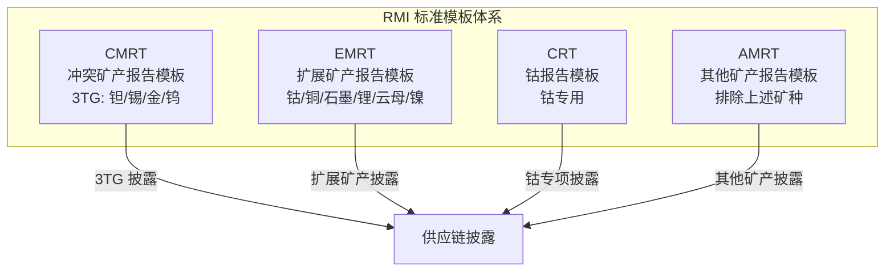
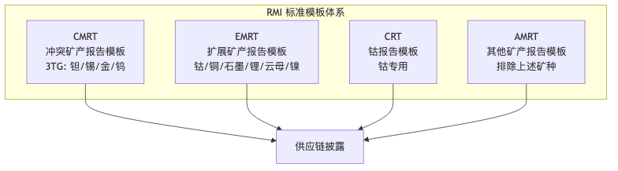

# 冲突矿产模板系统 PRD 文档

> 本文档体系为冲突矿产（Conflict Minerals）模板编辑/查看系统的产品需求文档，面向产品评审与研发实现。

## 快速导航

| 文档 | 说明 |
|-----|------|
| [00-overview.md](./00-overview.md) | 项目背景、术语定义、通用规则 |
| [01-cmrt-prd.md](./01-cmrt-prd.md) | CMRT 完整 PRD（6.01-6.5） |
| [02-emrt-prd.md](./02-emrt-prd.md) | EMRT 完整 PRD（1.1-2.1） |
| [03-crt-prd.md](./03-crt-prd.md) | CRT 完整 PRD（2.2-2.21） |
| [04-amrt-prd.md](./04-amrt-prd.md) | AMRT 完整 PRD（1.1-1.3） |
| [05-cross-template.md](./05-cross-template.md) | 跨模板对比与通用组件 |
| [prd-check-list.md](./prd-check-list.md) | ⚠️ PRD 待检查清单（字段核对） |

## 模板关系概览



## 版本基线

| 模板 | 版本范围 | 最新版本 |
|-----|---------|---------|
| CMRT | 6.01 - 6.5 | 6.5 (2025-04-25) |
| EMRT | 1.1 - 2.1 | 2.1 (2025-10-17) |
| CRT | 2.2 - 2.21 | 2.21 |
| AMRT | 1.1 - 1.3 | 1.3 (2025-10-17) |

## 核心角色

- **供应商/回复方**：填写或更新模板要求的申报数据
- **采购方/审核方**：查看、复核、导出/对齐模板要求

## 文档约定

1. **校验优先级**：模板文字要求（Instructions/表内说明）> Excel 校验标记（Checker/条件格式）> 产品约束
2. **语言口径**：模板要求英文作答，产品层面仅提示不强制
3. **日期格式**：统一为 `DD-MMM-YYYY`（如 `01-Jan-2026`）

## 图表说明

本文档使用 **Mermaid** 语法绘制流程图、架构图、实体关系图和时间线。支持渲染的平台包括：

- GitHub / GitLab（原生支持）
- VSCode（需安装 Markdown Preview Mermaid 插件）
- Typora、Obsidian 等 Markdown 编辑器

如需导出为图片，可使用：
- [Mermaid Live Editor](https://mermaid.live/)
- VSCode 插件导出功能

## 导出的 PNG 图片

所有图表均已导出为 PNG 格式，存放于 `assets/` 目录：

| 图片文件 | 说明 |
|---------|------|
| [01-architecture.png](./assets/01-architecture.png) | 系统架构图 - 模板关系概览 |
| [02-user-flow.png](./assets/02-user-flow.png) | 用户填写流程图 |
| [03-cmrt-flow.png](./assets/03-cmrt-flow.png) | CMRT 详细填写流程 |
| [04-smelter-flow.png](./assets/04-smelter-flow.png) | Smelter List 填写流程 |
| [05-validation.png](./assets/05-validation.png) | 校验规则优先级 |
| [06-cmrt-er.png](./assets/06-cmrt-er.png) | CMRT 数据模型 (ER图) |
| [07-emrt-flow.png](./assets/07-emrt-flow.png) | EMRT 详细填写流程 |
| [08-amrt-minerals.png](./assets/08-amrt-minerals.png) | AMRT 矿种选择流程 |
| [09-template-structure.png](./assets/09-template-structure.png) | 四模板页面结构对比 |
| [10-declaration-ui.png](./assets/10-declaration-ui.png) | Declaration 页面原型 |
| [11-smelter-ui.png](./assets/11-smelter-ui.png) | Smelter List 页面原型 |
| [12-checker-ui.png](./assets/12-checker-ui.png) | Checker 页面原型 |

### 图片预览

**系统架构图：**


**用户填写流程：**


## 目录结构

```
docs/
├── README.md              # 本文件 - 总入口
├── 00-overview.md         # 项目背景与通用规则
├── 01-cmrt-prd.md         # CMRT PRD
├── 02-emrt-prd.md         # EMRT PRD
├── 03-crt-prd.md          # CRT PRD
├── 04-amrt-prd.md         # AMRT PRD
├── 05-cross-template.md   # 跨模板对比
├── prd-check-list.md      # ⚠️ PRD 待检查清单
├── assets/                # 图片资源
│   └── prototypes/        # HTML 交互原型
└── archive/               # 归档的旧文档
```

## 修订历史

| 版本 | 日期 | 说明 |
|-----|------|------|
| 1.0 | 2026-01-26 | 初始版本，重构文档体系 |
