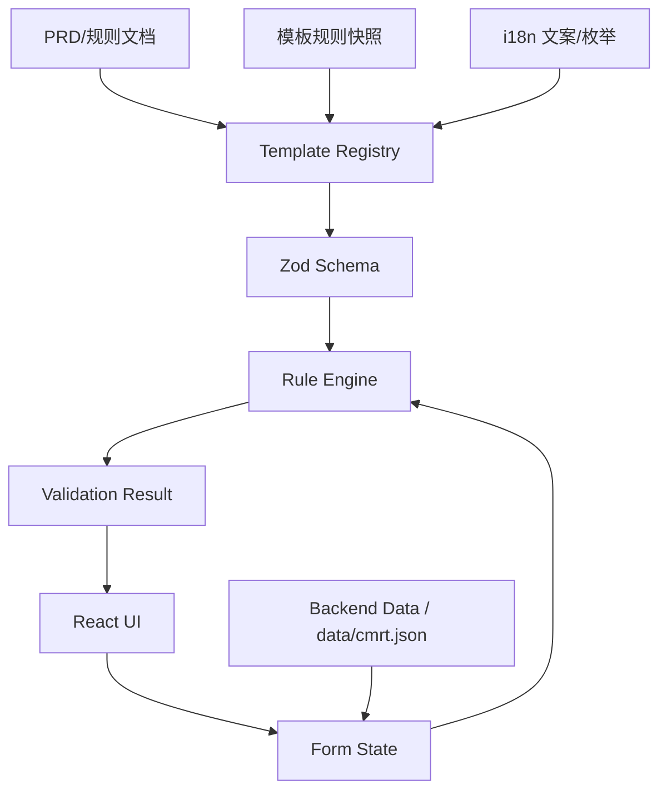

# 系统上下文与数据流

## 边界定义
- 本系统：多模板表单编辑与规则校验的前端框架
- 外部输入：PRD/模板规则快照、后端数据（未来）
- 外部输出：表单数据、校验结果、导出（未来）

## 系统上下文图（Mermaid）

## 核心数据流
1. Registry 装载模板/版本配置（字段、表格列、DV/Checker 规则、文案差异）。
2. Zod schema 生成 form 状态与校验基础（类型、安全、默认值）。
3. Rule Engine 依据 registry 与当前 form 状态计算：gating、required、DV 选项、checker 结果。
4. UI 根据结果呈现：禁用/高亮/错误定位/进度统计。

## 重要约束
- Instructions-only 规则需记录，但不强制进入 Checker（按 Excel 事实）。
- 规则变更必须回写 registry 并标注来源证据。
- 版本差异在 registry 层解决，UI 组件不内嵌版本判断。
