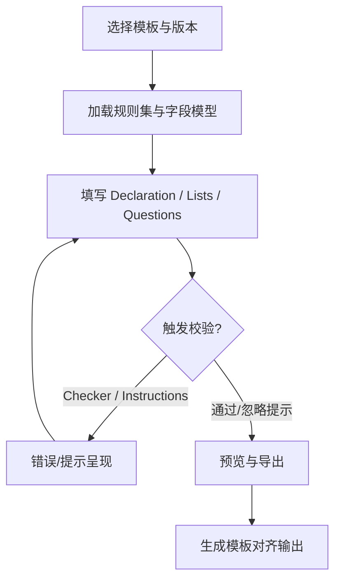

# 用户流程（填写/校验/导出）

## 主流程（统一视角）

## 关键交互点
- 版本选择决定：字段结构、问题矩阵、下拉选项、校验规则与导出列。
- 校验优先级：Instructions 文字要求 > Checker/条件格式 > 产品约束（详见 `docs/product/05-rules-and-validation.md`）。
- Smelter Look-up：不同版本/模板存在列差异（AMRT 1.1/1.2 无，1.3 有）。

## 角色视角
- 供应商/回复方：编辑、补全、校验、导出。
- 采购/审核方：查看、复核、对齐模板版本差异。

## 版本差异对流程的影响
- EMRT 2.0+ 新增 Mine List；1.x 无该流程。
- AMRT 1.3 使用下拉 + Other；1.1/1.2 为自由输入，影响问题矩阵与校验路径。
- CMRT/CRT/EMRT 的公司层面问题存在不同题目与选项口径。
