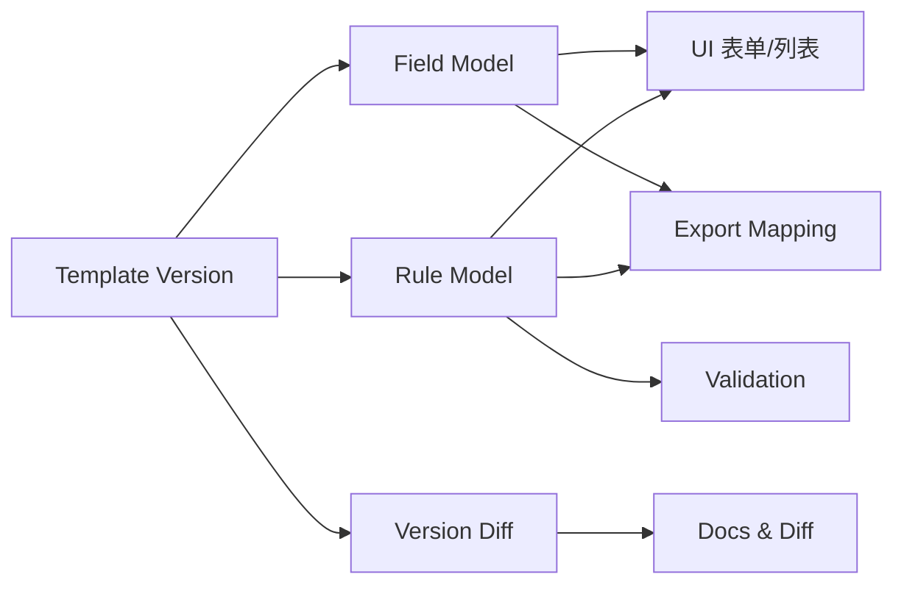

# 架构与规则体系

## 规则体系分层
- 规则来源：模板 Instructions + Checker + 表结构/条件格式。
- 规则优先级：**Instructions > Checker/条件格式 > 产品实现约束**。
- 版本边界：以“模板 + 版本”为唯一规则包，不跨版本推断。

## 组件关系（概念架构）

## 核心约束
- 版本规则独立：同模板内仅向后兼容显示/导出，填写逻辑不强兼容。
- 差异显性：字段名/选项/校验/列位移都应被文档化并可追溯来源。

## 来源
- 规则基线：`docs/prd/conflict-minerals-prd.md`
- 差异归档：`docs/diffs/*`
- 验收用例：`docs/diffs/acceptance/*`
