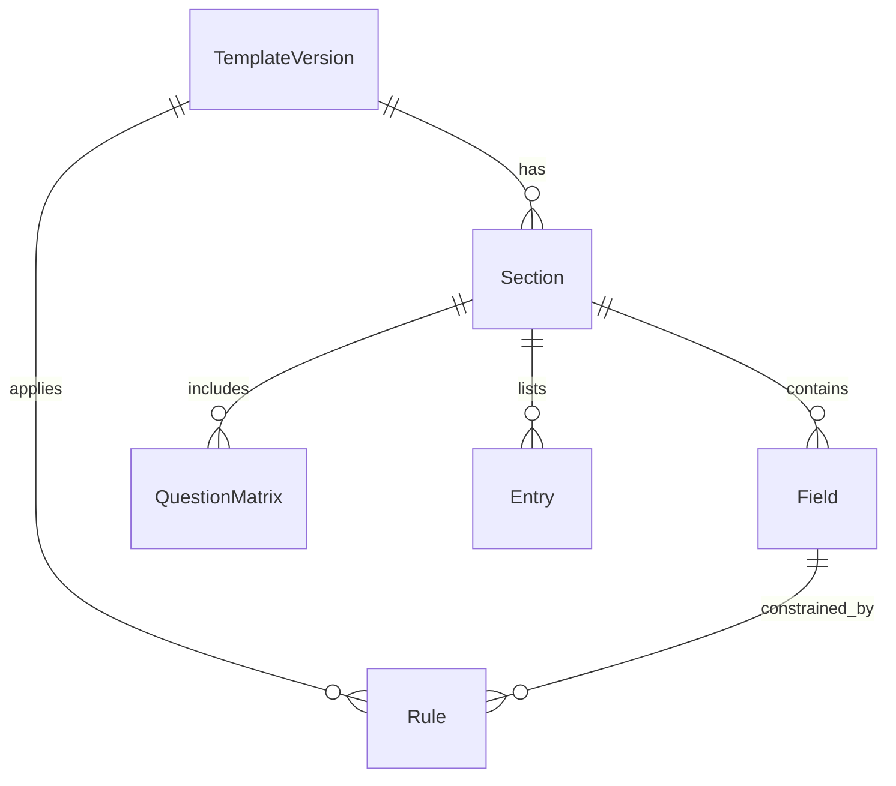

# 数据模型与实体关系（概念层）

## 核心实体
- TemplateVersion：模板与版本的唯一组合（CMRT/EMRT/CRT/AMRT + version）。
- Section：页面/Tab（Declaration、Smelter List、Mine List、Product List、Minerals Scope、Checker 等）。
- Field：字段定义（名称、类型、是否必填、版本差异、来源）。
- Rule：规则定义（触发条件、严重性、来源、版本范围）。
- QuestionMatrix：按矿种/金属展开的问题矩阵（Q1–Q8/Q1–Q7/Q1–Q6/Q1–Q2）。
- Smelter/Mine/Product Entry：列表行数据结构。

## 实体关系（概念）

## 关键字段组（来源：`docs/prd/field-dictionary.md`）
- Company Information（公司名称、联系人/授权人、地址、日期）
- Declaration Scope（申报范围或种类、范围描述、矿产申报范围）
- Minerals/Metals in Scope（矿种选择/Other 逻辑）
- Company-level Questions（仅 CMRT/EMRT/CRT）
- Smelter List / Mine List / Product List

## 版本差异映射
- TemplateVersion 决定 Field/Rule/QuestionMatrix 的具体形态与候选值。
- 例如：EMRT 2.0+ 新增 Mine List；AMRT 1.3 引入下拉与 Smelter Look-up。
